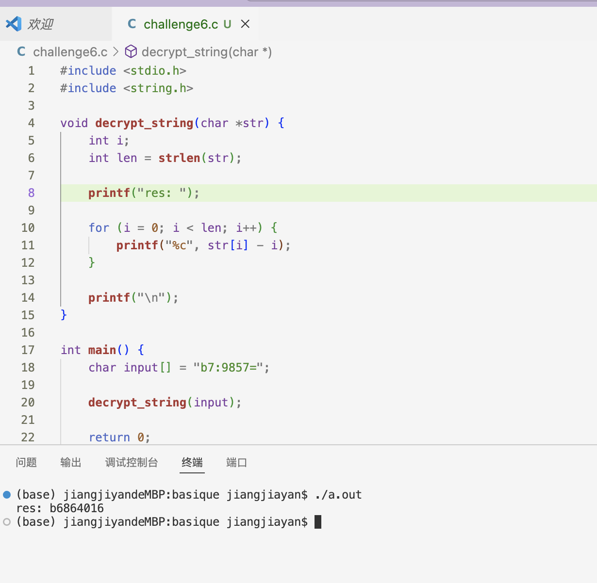
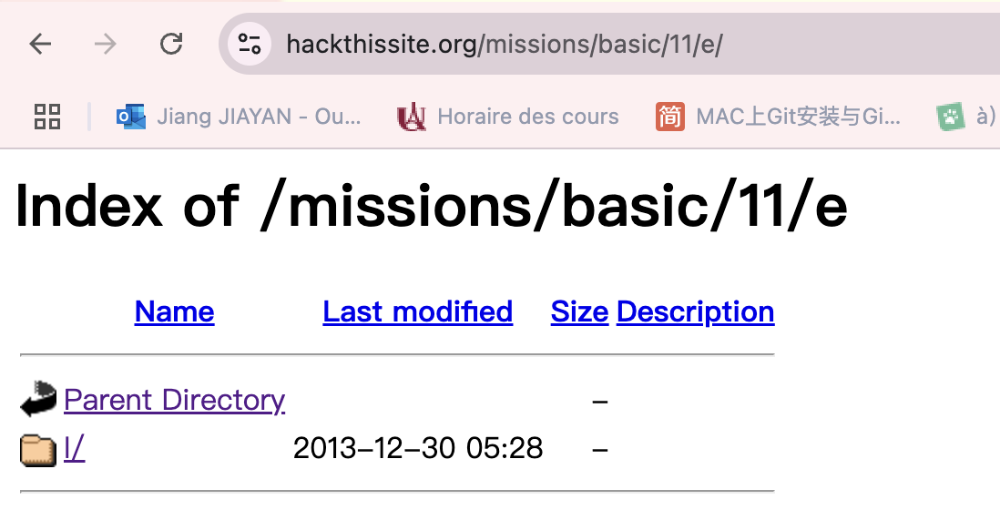

# cyber_basique
## Challenge 1
Ouvrir le code source de la page Web

On peux trouver so code est 675143f1.

## Chanllenge 2
Il a dit ”oublié de définir un mot de passe“，on pense que son mot de passe est vide, entrez directement.

## Chanllenge 3
En regardant dans le code source HTML du formulaire de soumission de mot de passe, nous trouvons le seul champ de saisie caché intéressant avec nom = fichier  valeur = mot de passe.php .

Cela ressemble au fichier de mots de passe que Sam a téléchargé. En visitant ce chemin, nous pouvons accéder au fichier password.php et il nous donne le mot de passe que nous recherchons.

## Chanllenge 4
Dans le code source HTML du formulaire « Envoyer le mot de passe à Sam », nous trouvons le seul champ de saisie caché intéressant avec name= to value= sam@hackthissite.org.

Changer cette adresse par mon propre email.Et puis on peut recevoir le code par notre mail,et il est réussi.

## Chanllenge 5

On va utiliser la même méthode de chanllege 4, mais on juste corrigé l’adresse à user.

## Challenge 6
En chiffrant une chaîne simple comme 'aaaa', nous obtenons la version chiffrée 'abcd'

à partir de ce modèle, nous pouvons deviner que l'algorithme de chiffrement incrémente chaque caractère d'un nombre ASCII dans l'ordre croissant. 
Nous pouvons écrire un programme pour décrypter le mot de passe crypté.

## Challenge 7
Cela devrait être une attaque par injection de commandes；
On essaye d'ajouter une commande après l’année 

`2024 && ls`

En bas nous voyons un fichier php nommé par un mot de passe

Ouvrez-le dans l'URL `https://www.hackthissite.org/missions/basic/7/k1kh31b1n55h.php`

Avec le code ,on a réussi.

## Challenge 8
D'après la description, nous utilisons les directives SSI pour générer du contenu dynamique côté serveur.
Nous utilisons une charge utile comme ` <!--#exec cmd="ls ../"-->` pour lister les fichiers

et puis on regarde 

il est facile de trouver une files inclu notre code
` https://www.hackthissite.org/missions/basic/8/au12ha39vc.php` 

Avec le code, on est réussi.

## Challenge 9
Revenez au niveau 8 et changez l'injection, en utilisant
 `<!--#exec cmd="ls ../../9"-->`
 
 

 Il fournit p91e283zc3.php.
 Cette fois, le mot de passe est a0e6a1e3
 

## Challange 10

Mettez n'importe quoi dans le champ du mot de passe, soumettez le formulaire et interceptez la demande avec brup suit. Changez la valeur de level_authorized de "no" à "yes". Vous avez terminé.
 

 ## Challenge 1
 Essayez d'ajouter a/, b/, c/ à la fin de l'URL pour vérifier jusqu'à ce que e, nous voyons la page Web suivante
 
  
 
 Gardez ses sous-dossiers ouverts：
  
  
  
  Il n'est plus disponible après n ，essayez d'accéder au fichier .htaccess

  

  On va à https://www.hackthissite.org/missions/basic/11/e/l/t/o/n/DaAnswer/
  

  Il a dit the answer is easy, on pense que "easy"est la mot de pass.
  On rentrer la page https://www.hackthissite.org/missions/basic/11/index.php et entrer le mot "easy",il est réussi.

  
