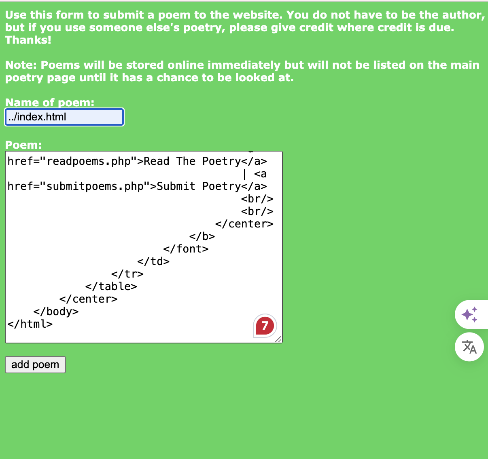

# Realistic

## 1.Uncle Arnold's Local Band Review

Une fois la page web ouverte, nous avons remarqué que chaque groupe avait un nombre de votes. 
Donc, pour que Raging Inferno atteigne le sommet du classement musical,
il suffirait de modifier les données de la page et d'attribuer un nombre élevé de votes. 
Ainsi, il obtiendrait une énorme quantité de votes et prendrait la première place.

## 2.Chicago American Nazi Party

### Méthod:injection SQL

1.Lorsqu‘on ouvert une page web sans aucun lien pour les prochaines étapes,
on peux inspecter le code source et y trouver un fichier PHP.
Pour l'exécuter, essayez d'ajouter ce fichier à l'URL dans la barre d'adresse du navigateur et rechargez la page.

Il semble qu'il y ait une injection SQL ici. Nous essayons d'utiliser "1=1", 
en donnant à la base de données une équation toujours vraie, pour voir si cela permet de contourner la vérification du mot de passe.

avec `admin 1' or 1=1 --+`
on a réussi .

### why `admin 1' or 1=1 --+`

## 3.Peace Poetry: HACKED

### Méthod : Vulnérabilité d'injection de chemin de fichier
Cette vulnérabilité exploite des chemins de fichiers non filtrés, vous permettant de modifier le contenu de n'importe quel fichier du site web

Ouvrez le code source de la page web et trouvez en bas une URL d'une page web avant qu'elle ne soit piratée.

Cliquez sur "Submit Poetry", vous pourrez voir un formulaire web à soumettre.

Dans le champ « Name of poem », vous avez entré ../index.html, 
ce qui pointe vers le fichier index.html situé dans le répertoire racine du site web. 
Grâce à cette opération de traversée de répertoires, 
vous avez contourné la restriction qui normalement ne permettait que la soumission de poèmes, 
et vous avez accédé directement au fichier de la page d'accueil du site web pour le modifier.

Bien que nous ne puissions pas consulter directement le code original de la page web à partir du code source de la page, 
nous pouvons le voir via check-sources.La section Poem correspond au code HTML de la page d'origine.

Lorsqu‘on saisisse du code HTML dans ce champ et clique sur « add poem », le système écrit ce code dans le fichier index.html spécifié,
modifiant ainsi le contenu de la page d'accueil.

