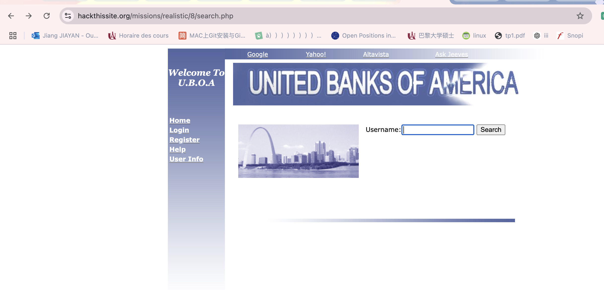
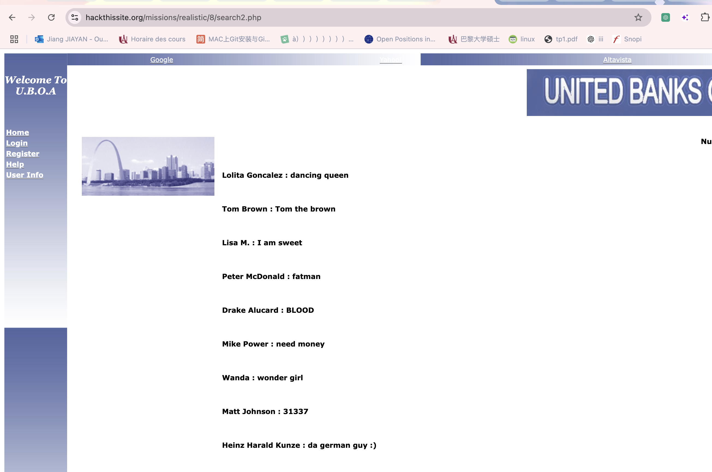
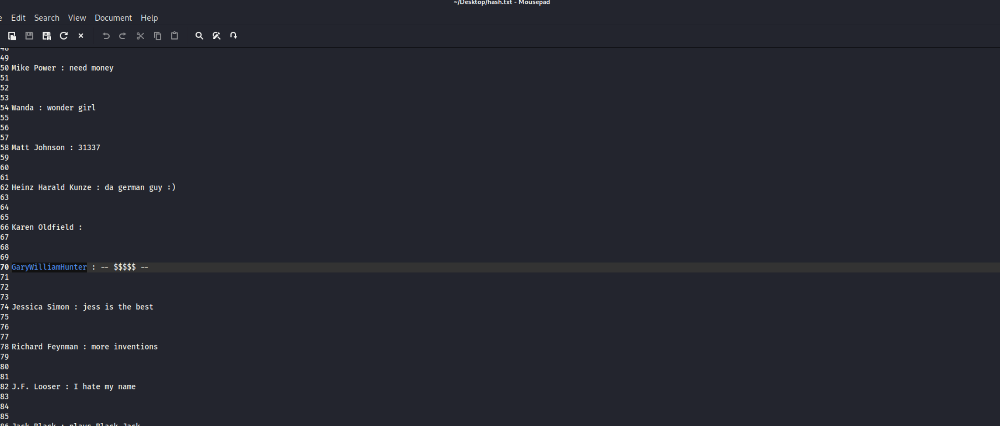
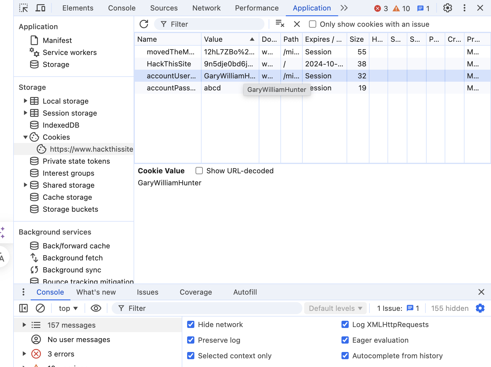
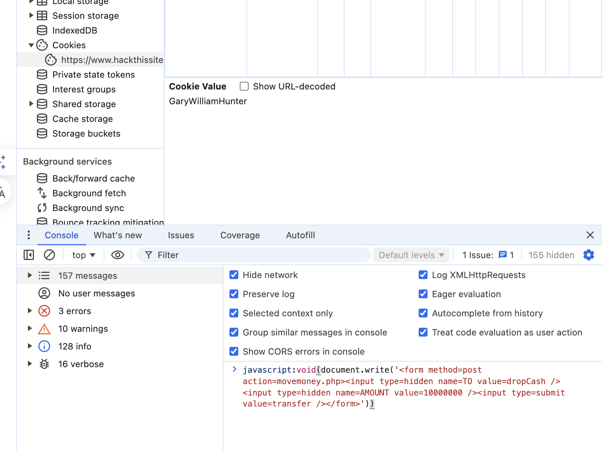
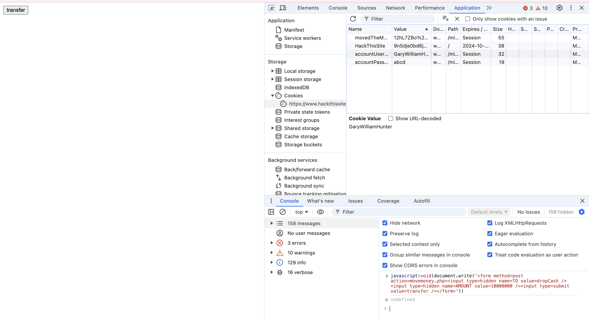
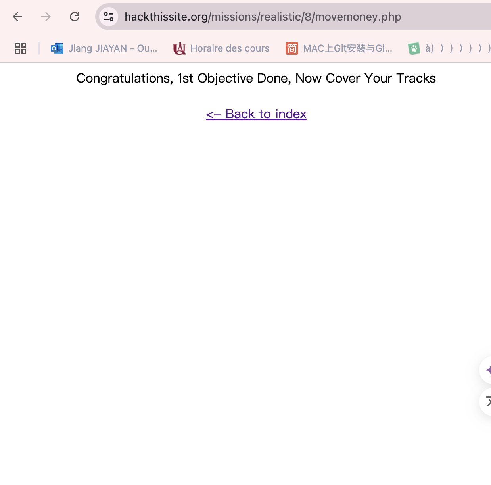

## 8.United Banks Of America

### Méthod: injection de SQL pour trouver le nom de l’utilisateur;Cookie tampering;JavaScript injection

#### 1.Chercher Gary Hunter
https://www.hackthissite.org/missions/realistic/8/index.php

aller à 'user info' :https://www.hackthissite.org/missions/realistic/8/search.php

1.1.Essayer l'injection sql

`a' or 1--` dans la partie  de 'username'

car il a 19917 résultats ,on le fait copier et coller sur txt pour chercher gary hunter.
et dans la liste de utilisateurs, il existe une ligne s’appelle 'garywilliamhunter',c’est le compte on veut chercher.
`GaryWilliamHunter：-- $$$$$ --`

#### 2.Transférer  l'argent

2.1 Créer un compte et se connecter.
Ouvre les outils de développement, trouve l'onglet "Application", localise "accountUsername" qui affiche actuellement ton nom, 
double-clique dessus pour le changer en "GaryWilliamHunter", et injecte du code JavaScript dans la console en bas.

2.2 injection  JavaScript 

`javascript:void(document.write('<form method=post action=movemoney.php><input type=hidden name=TO value=dropCash /><input type=hidden name=AMOUNT value=10000000 /><input type=submit value=transfer /></form>'))`

on peut regarder transférer à haut gauche 

Cliquez et il a dit on a réussi de transférer l’argent .

