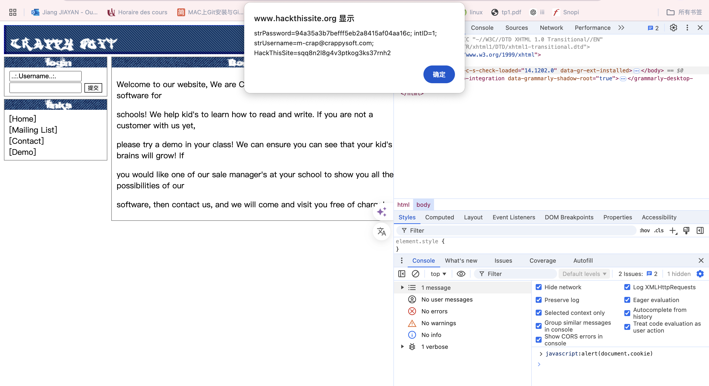
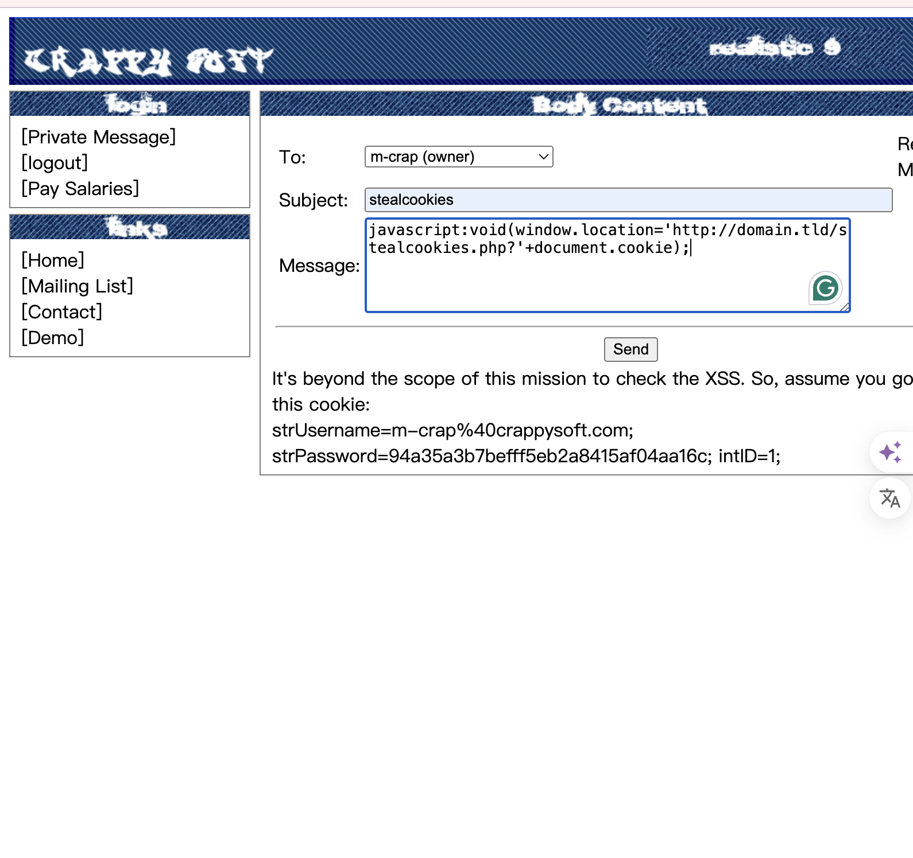
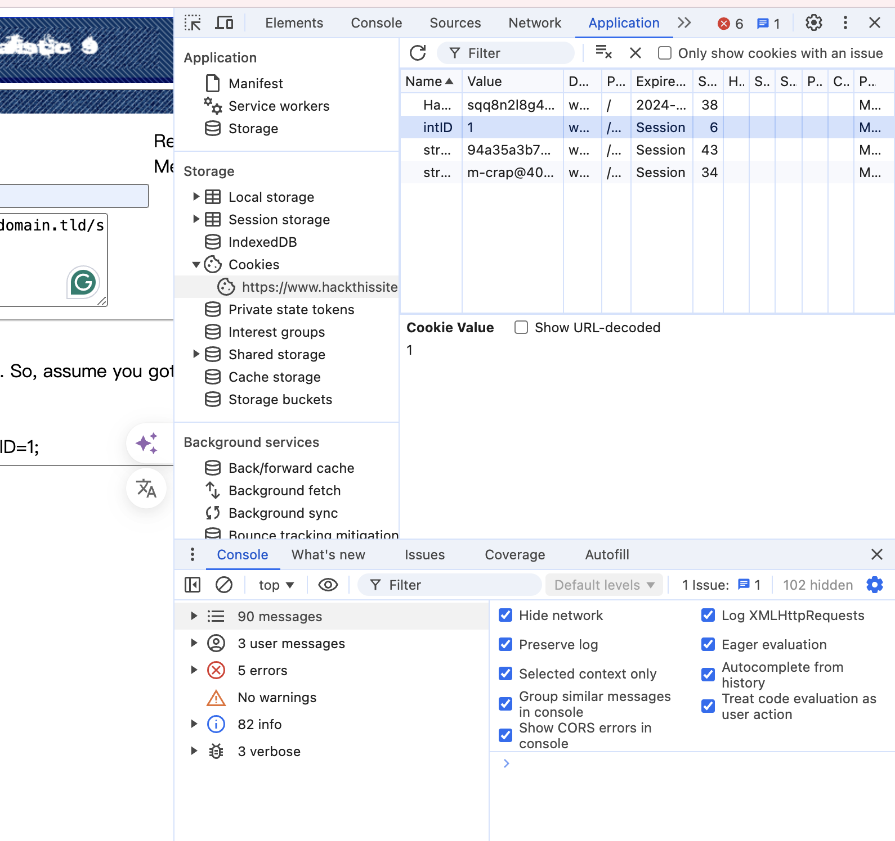
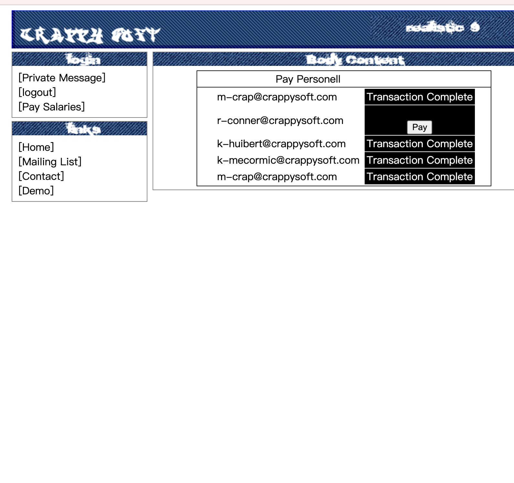
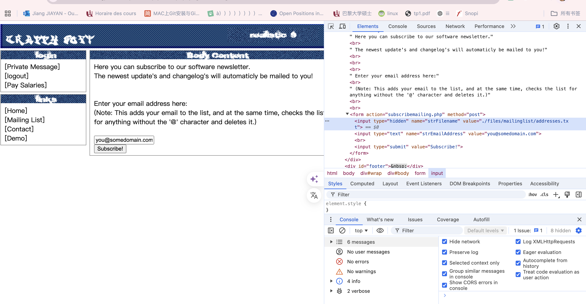
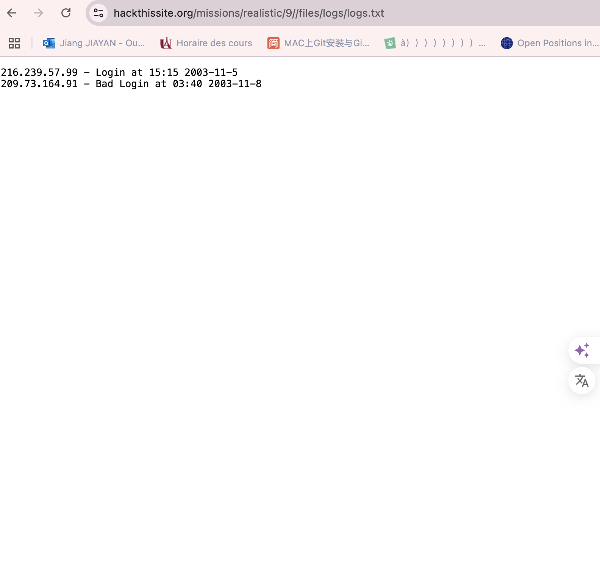

## 9.CrappySoft Software
###
From:

Message: Hey man,
I've heard you're good at hacking, and on the right side of things. So I came looking for you. I really need help, you see, my boss has stopped paying our salaries and I'm going to miss my rent! Please help me get my money, you can reach the site at Crappy Soft. They have an online payment system, but only he can use it. Maybe you can get into his account somehow, but for now you can use mine:

Username: r-conner@crappysoft.com
Password: ilovemywork

Thanks man, good luck.

Idée : Comme pour l'exercice précédent, nous pouvons nous connecter en utilisant le nom d'utilisateur et le mot de passe connus, puis modifier le cookie afin de changer le compte en propriétaire pour effectuer un transfert d'argent.

1.connection comme un propriétaire
1.1 logoin avec 'Username: r-conner@crappysoft.com  Password: ilovemywork'
et tester `javascript:alert(document.cookie);` sur console pour vérifier s'il existe injection JavaScrip.

1.2 Obtenir le mot de passe de la propriétaire 

La section des 'privite message' permet d'envoyer des messages au propriétaire, et il est possible d'y effectuer une injection de code JavaScript.

on peut regarder son info.

strUsername=m-crap%40crappysoft.com; 
strPassword=94a35a3b7befff5eb2a8415af04aa16c; 
intID=1;
1.3 corriger les cookies 
Comme ex08

Click on 'Pay salaries' il est réussi.

2.Couvrez vos traces

2.1. Cliquez sur le lien "Liste de diffusion" et modifiez le code source. Notez qu'il existe un champ caché nommé strFilename avec la valeur ./files/mailinglist/addresses.txt. Si vous regardez ce fichier, vous obtiendrez la liste des adresses email :

2.2
Remplacez simplement la valeur dans le champ masqué par ceci :
`./files/logs/logs.txt`

