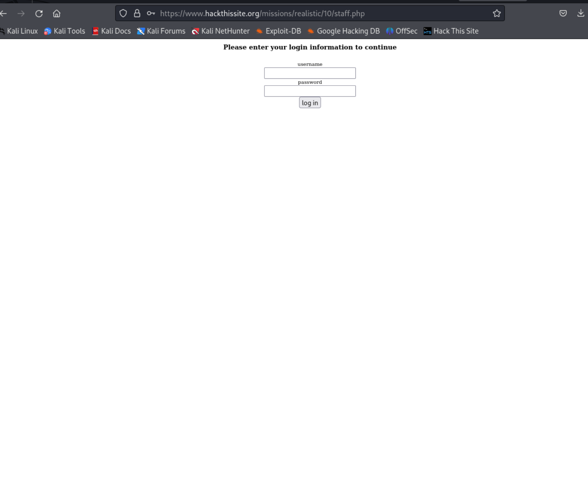
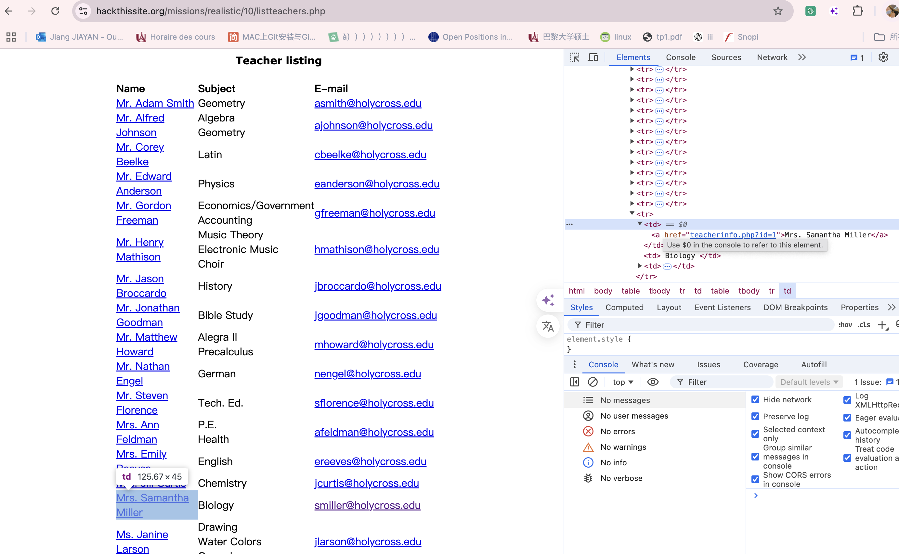
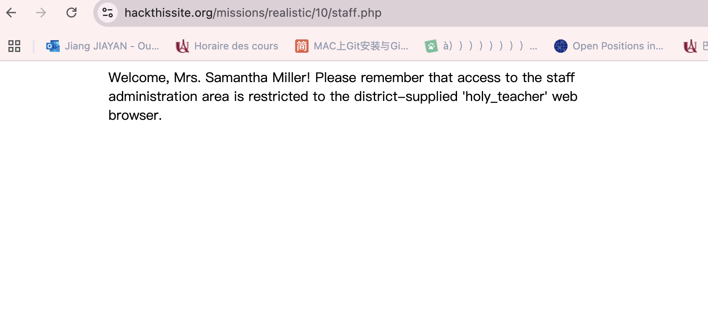
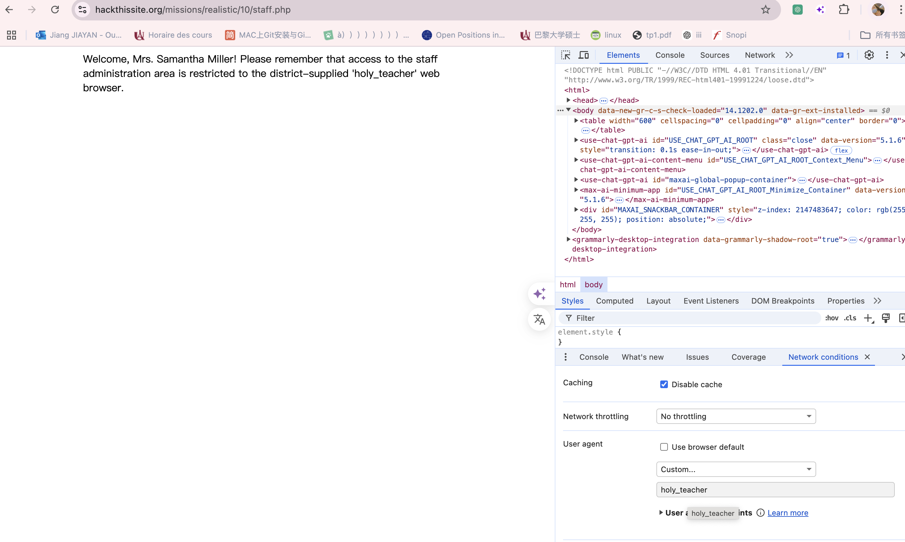
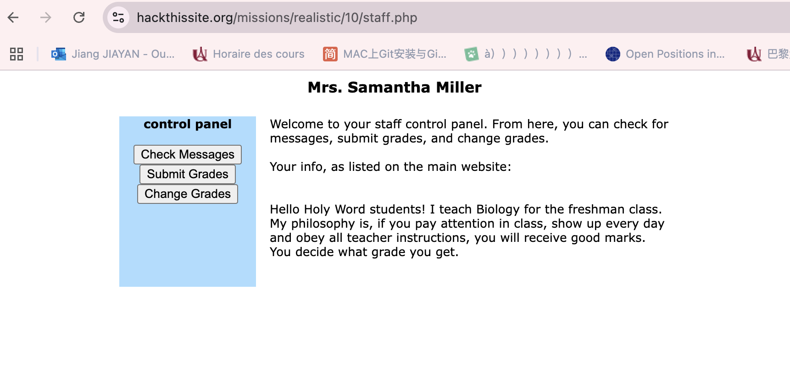
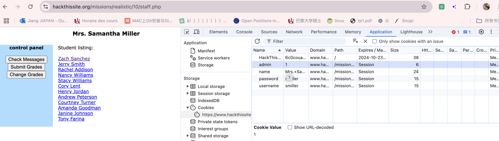
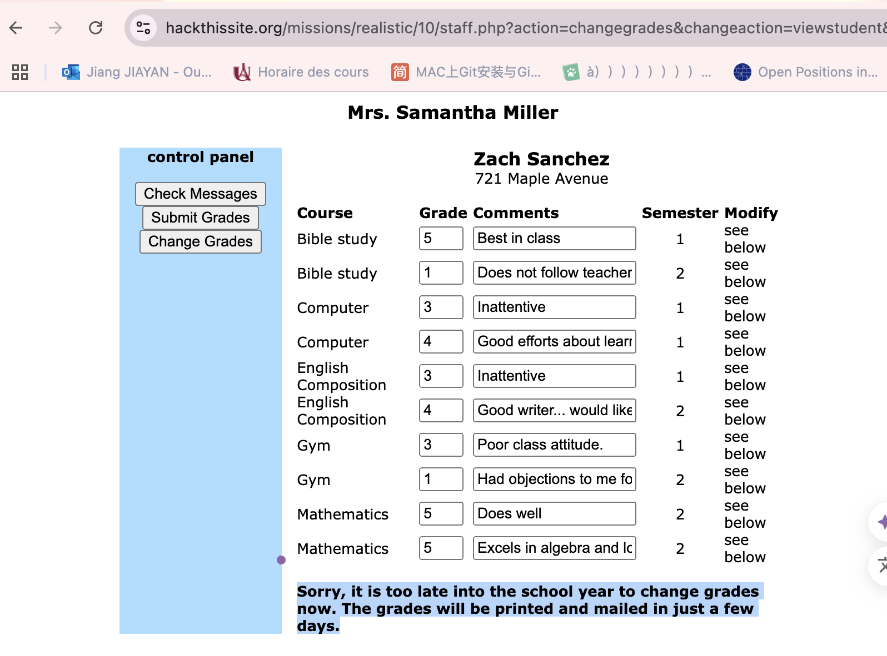
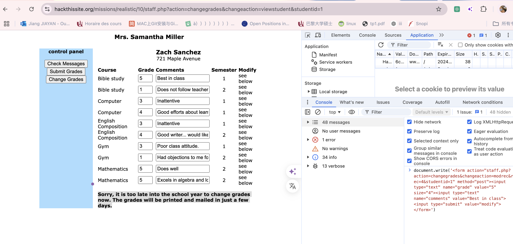
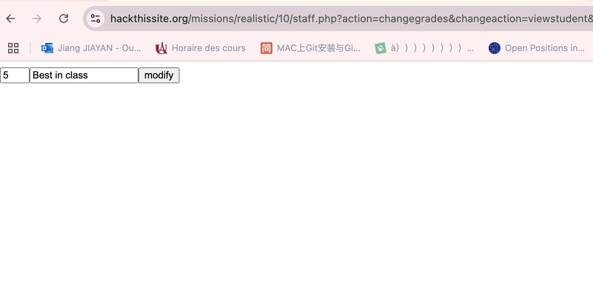
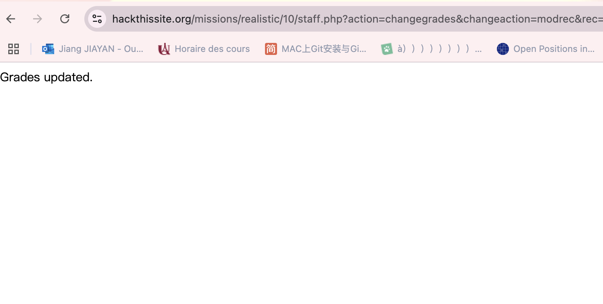

## 10. Holy Word High School

Message: hey man, it's me Zach, I need a favour from you, I'm in big trouble.
if you'll remember, I go to that super uptight religious school. well, two of my teachers are failing me because my lifestyle does not fall in line with their moralistic rules for public behaviour. My gym teacher even called me a 'long-haired hippie faggot'! And if I fail any classes, I won't graduate.
Listen, can you hack into the school's grade database and make it so I'm passing all my classes? 
I know they have this system set up on their website that allows teachers to submit grades and stuff, 
and I heard you pulled a few things in the past as well.
Their web master was not thinking in terms of computer security when he was designing the website, 
so it might be easy. Or not. Please check it out here. The username to my account is 'Zach Sanchez' and my password is 'liberty638'. 
Thanks man!

1.Dans la page d'accueil, on retrouve un lien pour le staff : staff.php.

https://www.hackthissite.org/missions/realistic/10/staff.php

2.
Retournez à l'écran d'accueil, ouvrez'staff list'et examinez le code source de la page.
Vous remarquerez qu'un id est associé à chaque nom de professeur. Trouvez le professeur avec l'id= 1, qui est très probablement l'administrateur

3.Revenez à la connexion du personnel .
Essayez smiller comme nom d'utilisateur et mot de passe comme mot de passe. Pas de chance. 
Le nom d'utilisateur. Essayez smiller comme nom d'utilisateur, smiller comme mot de passe, et vous y êtes.

4.Connectez-vous avec les privilèges d'administrateur

`Welcome, Mrs. Samantha Miller! Please remember that access to the staff administration area is restricted to the district-supplied 'holy_teacher' web browser.`

Cela nous oblige à en apprendre davantage sur les agents utilisateurs et sur l'en-tête HTTP User-Agent qui indique à un serveur le programme informatique qui tente d'y accéder. La zone d'administration du personnel est limitée à un navigateur Web spécifique, comme indiqué par l'en-tête User-Agent.

Dans Chrome, les étapes ici ont fonctionné pour moi. Ouvrez les outils de développement, 
cliquez sur l'icône Menu (elle est représentée par trois points verticaux) 
et accédez à Plus ' More tools > Network conditions' du réseau. Sous Agent utilisateur, 
décochez la case Sélectionner automatiquement et dans la zone de forme libre ci-dessous, 
saisissez Holy_teacher. Rechargez la page après avoir effectué cette modification et elle devrait se charger correctement maintenant. 
Vous devrez peut-être garder les outils de développement ouverts pour que la modification de l'agent utilisateur persiste.

5.Se donner des privilèges d'administrateur

Maintenant que la page se charge correctement, vous verrez trois boutons sur le côté gauche de la page. L’un d’eux est Change Grades, ce qui semble être ce que nous souhaitons. Mais il y a un message sous le bouton disant :
remarque : vous n'êtes pas un administrateur, vous ne pouvez donc pas modifier les notes

Nous devons nous accorder des privilèges d'administrateur. La première chose que j'ai vérifiée après avoir vu ce message était le cookie du site. Il y a une valeur dans le cookie pour l'administrateur et elle est actuellement définie sur 0. Remplacez-la par 1 et vous pouvez maintenant accéder à la page Modifier les notes.

6.Changer les notes de Zach

Mais après changer la privilèges 

`Sorry, it is too late into the school year to change grades now. The grades will be printed and mailed in just a few days.`
La meme méthod que ex08,ex09, on fais une injection de JavaScript 
`document.write('<form action="staff.php?action=changegrades&changeaction=modrec&rec=4&studentid=1" method="post"><input type="text" name="grade" value="5" size="4"><input type="text" name="comments" value="Best in class"><input type="submit" value="modify"></form>')
`
L’exécuterez sur console.

