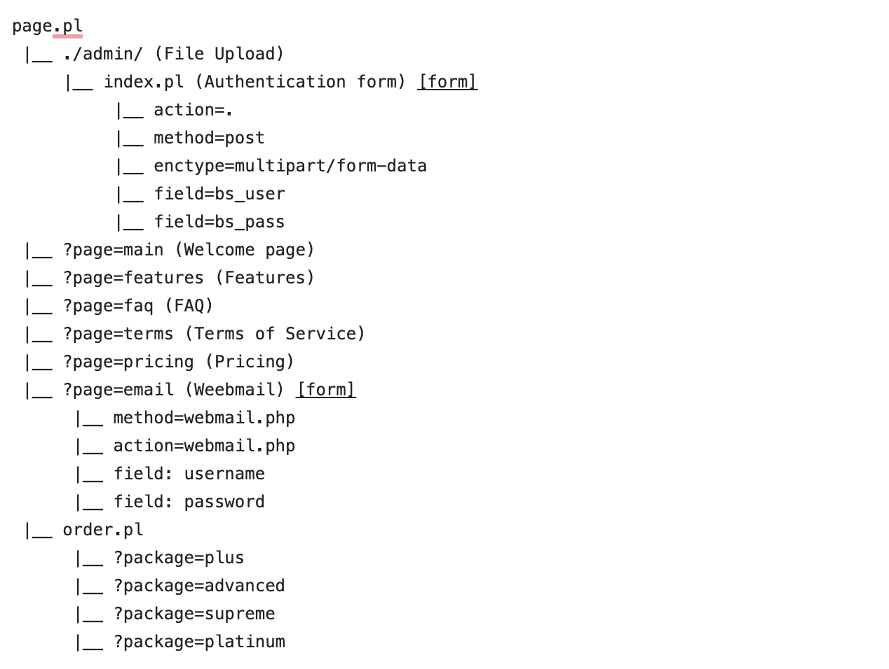
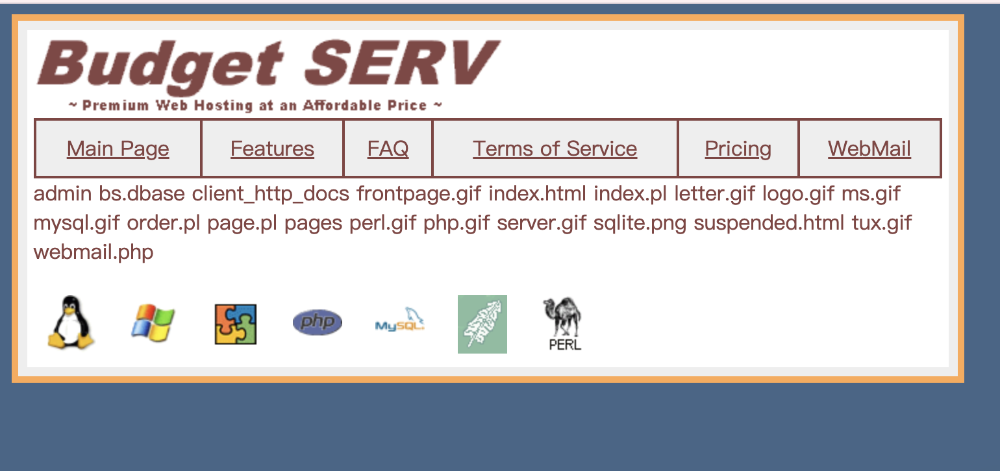
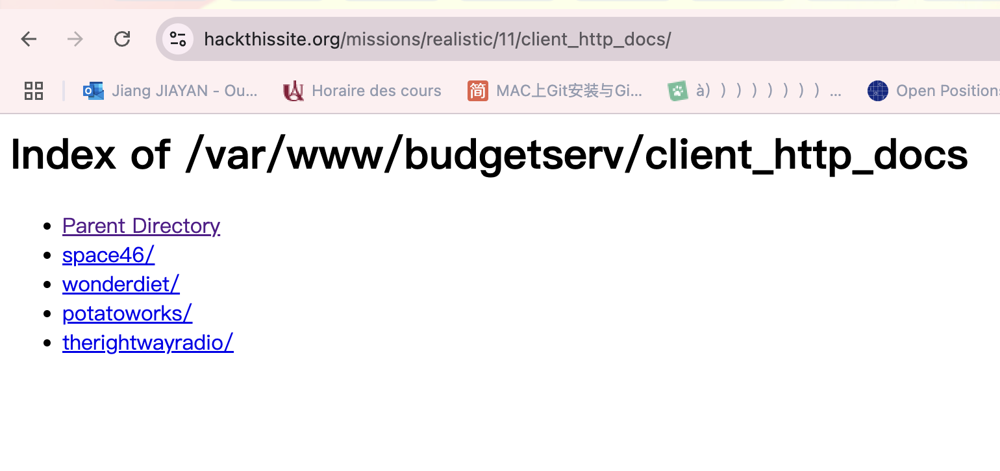
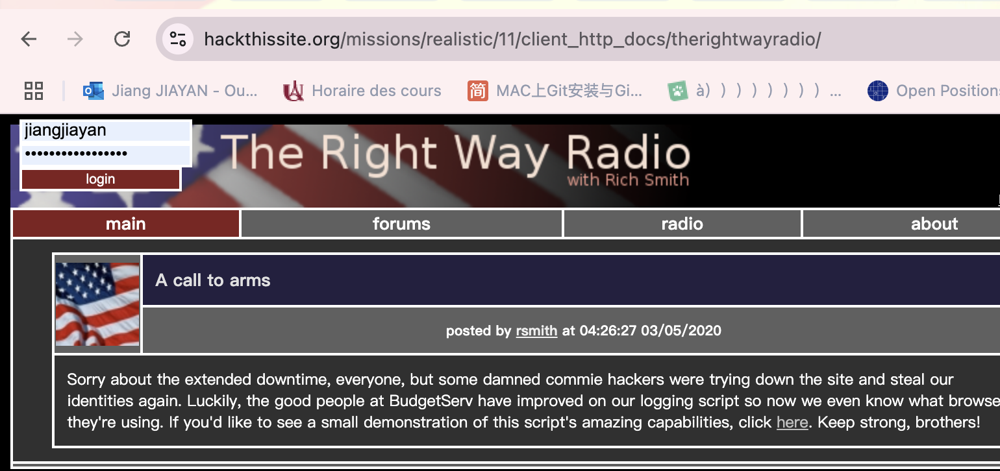
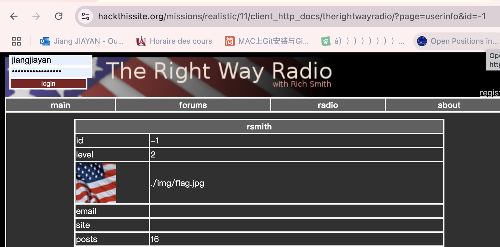
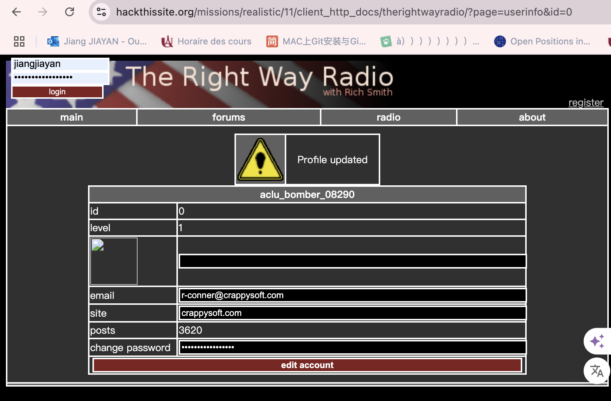
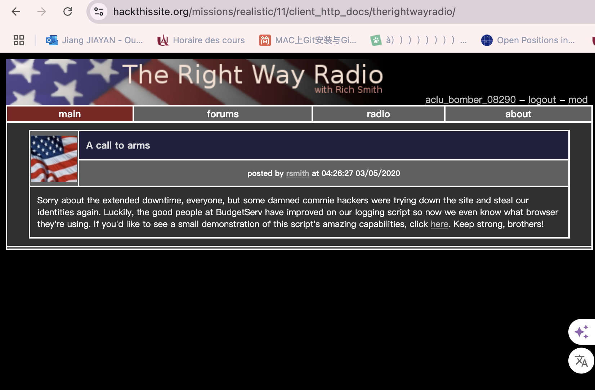
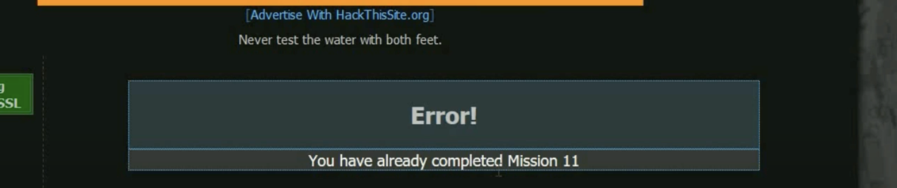

### 11.BudgetServ Web Hosting

Message: Hello, I'm space46 from space46.nod. Up until recently, BudgetServ used to be a good host, but the company got new owners and some lame hosted site was deleted somehow. The administrators think that it was me and they've suspended my account. I've contacted them numerous times about getting my files back but they refuse. As it so happens, I made a backup in my web root named src.tar.gz right before the account was suspended. Can you get this file back so that I can move to a better host?

1. Structure du site web

2.On remarque que le site est géré par un script Perl avec un contrôleur nommé "page.pl" qui accepte un paramètre nommé "page" (?page=). En lui envoyant un tube avec une commande ls unix, on peut récupérer le contenu du site :

http://www.hackthissite.org/missions/realistic/11/page.pl?page=%7Cls%7C

3.
  Client web: client_http_docs
  admin
  bs.dbase

En vérifiant le répertoire client_http_doc, il fournit une liste de comptes :

aller à 'therightwayradio/'

Clique 'rsmith'

C'est un drapeau et son identifiant est -1.

L'identifiant de l'administrateur est généralement 1 ou 0

https://www.hackthissite.org/missions/realistic/11/client_http_docs/therightwayradio/?page=userinfo&id=0

quand id = 0,il existe un utilisateur comme admin.

Il semble que vous puissiez changer le mot de passe ici et remplacer le mot de passe par son nom d'utilisateur et connecter.

On dirait qu'il n'est pas administrateur, nous avons besoin du mot de passe administrateur.

4.consulter sa base de données 

Cliquez sur mod en haut à droite

Consultez le formulaire de l'entreprise ici
Effectivement, ce compte dispose de privilèges administratifs. Une fois connecté, vous verrez que le coin supérieur droit de la page suivante contient différents liens, dont un appelé mod. Cliquez dessus et vous êtes redirigé vers une page où vous pouvez saisir une requête SQL. L'intention ici semble être que vous puissiez interroger une base de données contenant des données du site de The Right Way Radio. Un message utile nous indique que le backend utilise SQLite pour la gestion de la base de données. Si vous inspectez le formulaire à l'aide des outils de développement, vous verrez ceci :
`
<form method="post" action="./?page=mod" enctype="multipart/form-data">
	<input type="hidden" name="page" value="mod">
	<input type="hidden" name="sql_db" value="rwr.dbase">
	<input type="text" name="sql_query" style="width: 80%"> 
	<input type="submit" name=".submit" value="sql query" class="submit">
	 
	SQLite access for moderators has been tightened to read-only due to the recent security breech.
</form>

`
Puisque nous sommes actuellement sur la page https://www.hackthissite.org/missions/realistic/11/client_http_docs/therightwayradio/?page=userinfo et que le fichier bs.dbase se trouve à https://www.hackthissite.org /missions/realistic/11/bs.dbase, le chemin relatif vers bs.dbase est ../../../bs.dbase. Modifiez le HTML du formulaire pour que la valeur de sql_db soit ../../../bs.dbase. Le formulaire ressemblera désormais à ceci :
`
<form method="post" action="./?page=mod" enctype="multipart/form-data">
	<input type="hidden" name="page" value="mod">
	<input type="hidden" name="sql_db" value="../../../bs.dbase">
	<input type="text" name="sql_query" style="width: 80%"> 
	<input type="submit" name=".submit" value="sql query" class="submit">
	 
	SQLite access for moderators has been tightened to read-only due to the recent security breech.
</form>
`
Puisque nous avons modifié le formulaire pour interroger le fichier de base de données auquel nous souhaitons accéder, nous devons donner à la base de données une requête utile. Le détail selon lequel il s'agit d'une implémentation SQLite est utile, car la FAQ officielle de chaque SQLite explique que chaque base de données SQLite contient une table sqlite_master qui répertorie la table et le nom de l'index. Tapez SELECT * FROM sqlite_master et cliquez sur le bouton de requête SQL.

La page résultante charge un tableau avec une ligne et quatre colonnes. Il existe une table appelée web_hosting et nous pouvons voir que web_hosting contient des colonnes comprenant web_user, web_pass, web_package et web_email.

Si vous repensez à la page de connexion au panneau de service que nous avons trouvée plus tôt sur https://www.hackthissite.org/missions/realistic/11/admin/, nous sommes sur le point de pouvoir y accéder. Nous avons accédé aux données du fichier bs.dbase, nous avons trouvé la table que BudgetServ utilise pour stocker les informations d'identification du compte, et il ne nous reste plus qu'à interroger la table elle-même. En utilisant la même zone de saisie de requête SQL, tapez SELECT * FROM web_hosting et cliquez sur le bouton de requête SQL. Lorsque la page se chargera, nous verrons les adresses e-mail, les noms d'utilisateur et les mots de passe des utilisateurs de BudgetServ, le tout en texte brut.
Connexion au panneau de service
Revenez au panneau de service sur https://www.hackthissite.org/missions/realistic/11/admin/ et essayons quelques informations de connexion. Essayez le nom d'utilisateur et le mot de passe de space46 si vous le souhaitez, mais vous recevrez un message disant : Ce compte a été suspendu en raison d'un contenu inapproprié. Nous devrons essayer un autre compte. Soit therightwayradio, soit Wonderdiet fonctionneront. Choisissez le compte et les identifiants de votre choix pour vous connecter. Pour moi, j'ai utilisé therightwayradio et son mot de passe correspondant.

Récupérer les archives
Bricolez avec le panneau d'administration et vous verrez que vous pouvez télécharger différentes parties du site du client à des fins de sauvegarde. Vérifiez les outils de développement et vous verrez que chaque option radio a une valeur correspondant au chemin de fichier approprié. J'ai essayé de modifier la valeur de l'une des options en /var/www/budgetserv/html/client_http_docs/space46/src.tar.gz, en sélectionnant cette option radio et en cliquant sur Télécharger, mais j'ai reçu un message d'accès refusé. J'étais sur la bonne voie mais il faut être un peu plus malin.

Si vous sélectionnez une autre option radio et cliquez sur Télécharger, vous verrez très probablement une invite de téléchargement apparaître. Annulez à partir de cette fenêtre, puis consultez l'onglet Réseau des outils de développement pour mieux comprendre ce qui s'est passé. Vous devriez voir une requête GET vers un chemin avec une structure d.pl?file=/, comme https://www.hackthissite.org/missions/realistic/11/admin/d.pl?file=/var/www/ budgetserv/html/client_http_docs/therightwayradio/./. Et si vous modifiiez cette URL directement et essayiez d'y accéder ?

Changez l'URL en https://www.hackthissite.org/missions/realistic/11/admin/d.pl?file=/var/www/budgetserv/html/client_http_docs/space46/src.tar.gz et essayez d'y accéder dans votre navigateur. Cela déclenchera le téléchargement de la sauvegarde de space46 et terminera la mission.
