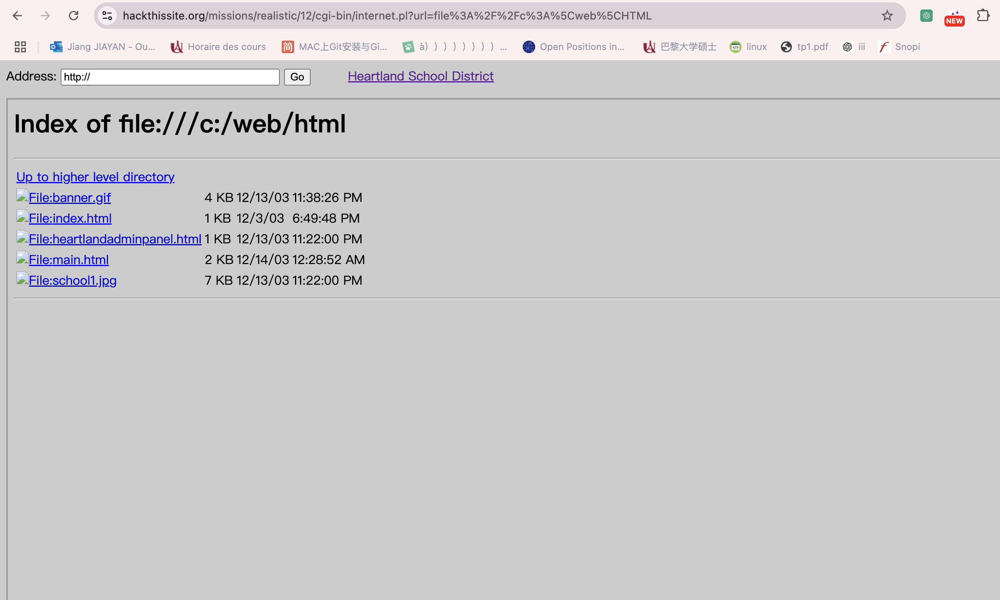
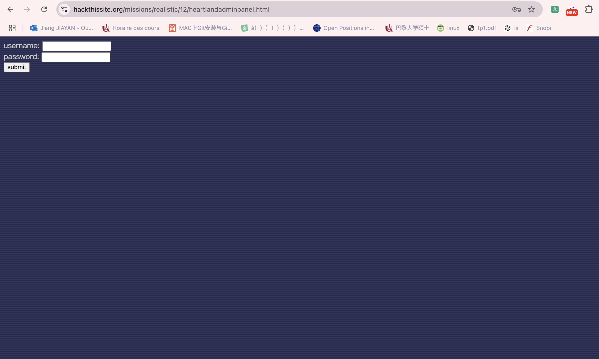
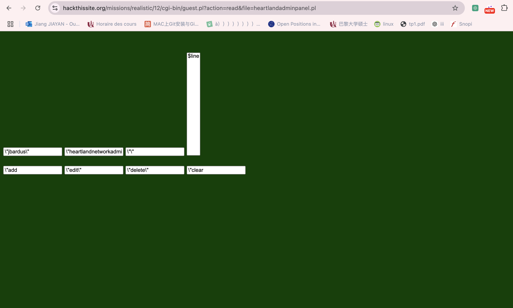
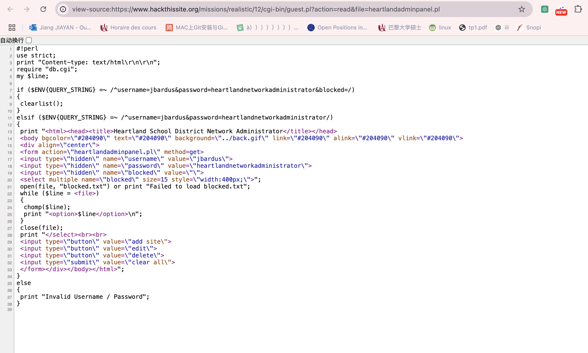
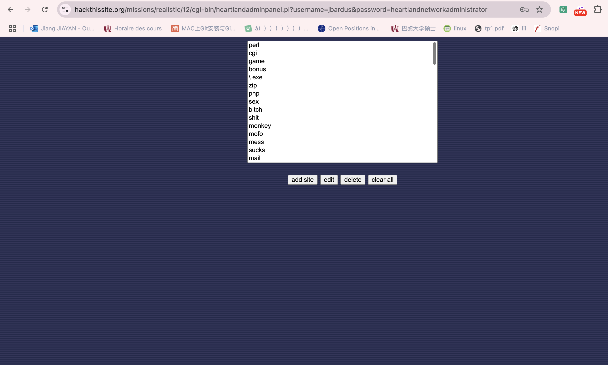
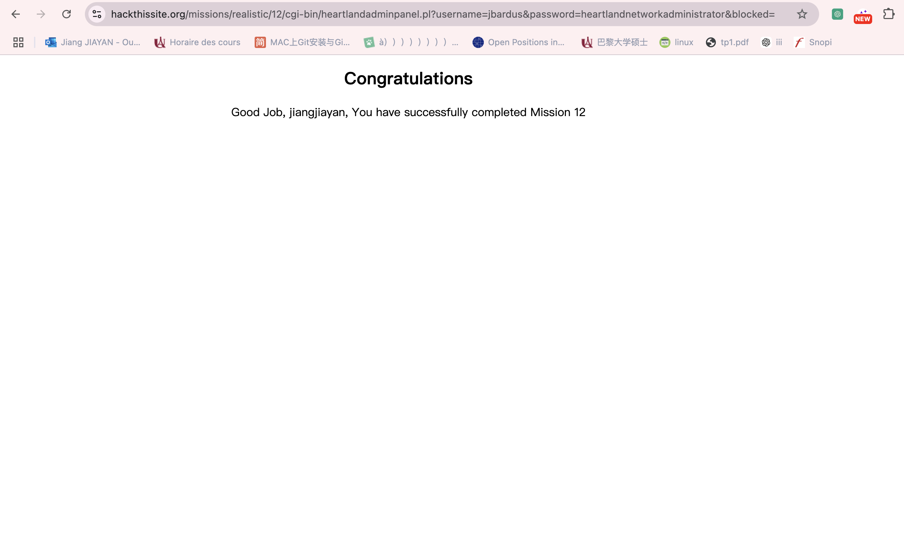

## 12.Heartland School District

Message: Hey it's OutThere from hackthissite.org. 
I've run into a problem that I can't seem to solve. As you may know, I go to Heartland High School, 
and our school put everything on the internet a few years ago. This was great at first, but then this really uptight guy,
Jason Bardus, got a job as a computer teacher.
He set up this overly restrictive web proxy and made it so that school computers 
could only connect to the district site. He hates people who know more than him, so he blocked all these hacker sites, o
pen source websites, and he even blocked google! He is really paranoid about security, 
but I don't think he really knows what he is doing. The district site is here, 
and it runs on some crappy Windows 95 machine, if that helps.
Can you clear the list of blocked pages by getting admin access? Please help me out, because information should be for everyone.

#### 1.La page d’accueil 
L’aperçu de la mission nous fournit deux détails utiles. Premièrement, nous connaissons le nom du professeur d'informatique qui a configuré le proxy Web que nous essayons d'effacer. Deuxièmement, nous avons affaire à un serveur Web exécutant Windows 95.

Après avoir cliqué sur le site, la première chose que j'ai essayée a été la barre d'adresse dans le coin supérieur gauche de la page. J'ai essayé d'accéder à https://www.google.com et bien sûr, vous recevrez un message indiquant que la page est bloquée. Ce proxy fonctionne vraiment.

Revenez à la page d'accueil et consultez les autres pages du site. Il n'y a rien de particulièrement intéressant dans la page Résultats des tests, mais les pages de M. Bardus (rappelez-vous qu'il est le professeur d'informatique qui a créé le proxy Web) et de M. Englebert dans la section Pages de l'enseignant nous conduisent à la section Travaux des étudiants. La page de Joey Simons est la seule avec une fonctionnalité qui pourrait être intéressante. Il y a un lien pour signer son livre d'or, qui mène ensuite à une page avec un formulaire. Si nous inspectons le HTML brut de ce formulaire, cela ressemble à ceci :

`
<form action="../cgi-bin/guest.pl">
	<input type="hidden" name="action" value="write">
	Message: 
	<input type="text" name="text" size="50">
	<input type="submit" value="submit">
</form>
`
* l'action du formulaire est "../cgi-bin/guest.pl", un script Perl dans cgi-bin/ 
*il existe un champ caché nommé action, dont la valeur est "écrire". Nous supposons qu'il existe une valeur "read" pour lire les fichiers.

#### 2.Accéder au disque dur

Le contrôleur principal (internet.pl) n'est pas protégé. En effet, il est possible de demander le contenu du disque dur en injectant "file://" au lieu de "http://". On découvre un nouveau formulaire, nommé "heartlandadminpanel.html" dans C:\WEB\HTML :

https://www.hackthissite.org/missions/realistic/12/heartlandadminpanel.html

#### 3.Intrusion de fichiers locaux via 'the guest book'

Lorsque nous avons examiné la fonctionnalité de livre d'or de Joey Simons, nous avons trouvé cette URL en suivant l'activité du réseau : https://www.hackthissite.org/missions/realistic/12/cgi-bin/guest.pl?action=read&file=guestbook. SMS

Modifiez l'URL afin qu'au lieu de lire le fichier guestbook.txt, nous lisions le nouveau script que nous avons découvert, heartlandadminpanel.pl : https://www.hackthissite.org/missions/realistic/12/cgi-bin/guest .pl?action=read&file=heartlandadminpanel.pl

Regarder son resource 

on peut trouver le nom et mots de passe 

`
 <form action=\"heartlandadminpanel.pl\" method=get>
 <input type=\"hidden\" name=\"username\" value=\"jbardus\">
 <input type=\"hidden\" name=\"password\" value=\"heartlandnetworkadministrator\">
 <input type=\"hidden\" name=\"blocked\" value=\"\">
`

#### 4.login avec jbardus

Clique 'clear all'

