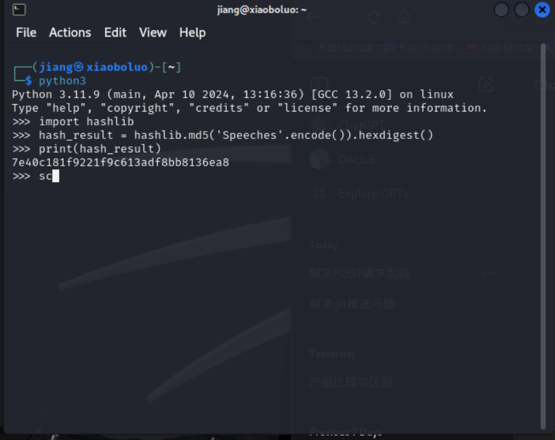
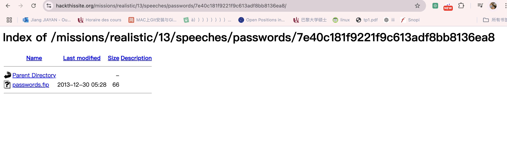
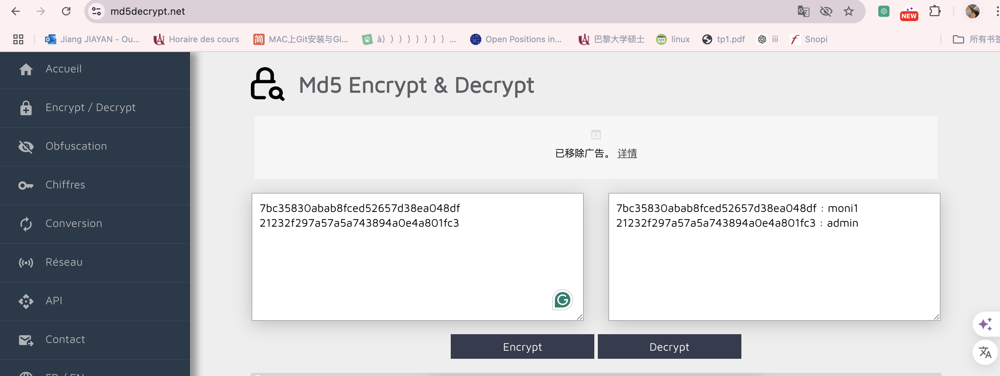
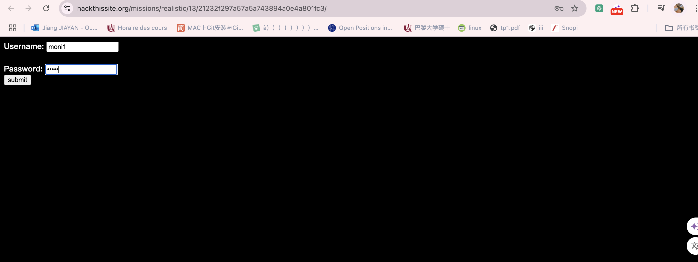
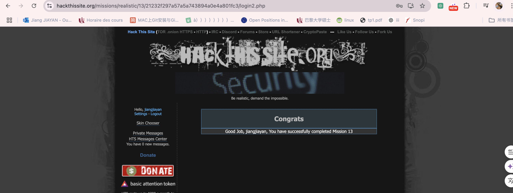

## 13.Elbonian Republican Party

Message: Hey, Josh Haze (a.k.a. Fr0zenB1t) here, I REALLY need some help. As you know, I'm in with the AOE (Anarchists of Elbonia). Our mission is to thwart the upcoming elections, and at least attempt to delay them for the time being. The way we've decided would work best is if one of the main competitor's site is taken down. Even if it is down for a small amount of time, things wont go smoothly for him, and things will be delayed...
### Details from the Site Layout
Notre objectif est de trouver un moyen de pénétrer dans le site Web, probablement pour le détruire.
hors ligne. Dans cet esprit, jetez un œil aux pages du site et voyez ce qui se passe
dehors.

#### Homepage
La page d'accueil et les pages suivantes du site incluent des images provenant des images/
sous-répertoire, et y accéder révèle un répertoire qui a le répertoire
liste activée. Il n'y a rien d'autre de valeur, malheureusement, mais ceci est de
note.

#### News
The
[News](https://www.hackthissite.org/missions/realistic/13/news.php?month=all)
la page a une mise à jour du 10 septembre qui mentionne qu'une partie du site est en cours
recodé. Cela semble utile. Falsification de l'URL et suppression d'un mois
Le paramètre donne également les résultats suivants :
```
MySQL Error Reported: row "" does not exist
Error in query: "SELECT post, date FROM newsTable WHERE month =""
```

#### Debates, Members, and Economy
The [Debates](https://www.hackthissite.org/missions/realistic/13/debates.php),
[Members](https://www.hackthissite.org/missions/realistic/13/members.php), et
[Economy](https://www.hackthissite.org/missions/realistic/13/economy.php) 

#### Newsletter
[This page](https://www.hackthissite.org/missions/realistic/13/newsletter.php)
les mentions recommencent avec les newsletters. Il y a une note indiquant que pour commander un
newsletter, vous aurez besoin d'une URL de connexion et d'un mot de passe cachés. Cela suggère
il y a des parties cachées du site qui ne sont pas destinées aux utilisateurs réguliers
accéder.
#### Mailing List
The [Mailing
List](https://www.hackthissite.org/missions/realistic/13/mailinglist.php) page
dispose d'un formulaire pour s'inscrire aux événements à venir. Saisir une adresse d'apparence valide comme
hello@hello.com et cliquer sur ajouter envoie une requête POST à
https://www.hackthissite.org/missions/realistic/13/addmail.php, which yields
this message:
```
"hello@hello.com" could not be added to "emails_table"
Please Contact Administrator
```

#### Speeches
[This page](https://www.hackthissite.org/missions/realistic/13/speeches.php)
vous donne la possibilité de choisir l'option vocale 1 et de cliquer sur Afficher, ce qui envoie
une requête POST à
https://www.hackthissite.org/missions/realistic/13/speeches2.php.Mais quelque chose
drôle se produit lorsque vous accédez directement à Speeches2.php. Vous recevez six avertissements
messages avec des messages de trace de pile étranges. Nous y reviendrons.

#### Press Releases
The [Press
Releases](https://www.hackthissite.org/missions/realistic/13/press.php) la page a
gestion des erreurs similaire à celle de la page Discours. La boîte déroulante vous permet de choisir parmi
trois options qui envoient une requête POST à
https://www.hackthissite.org/missions/realistic/13/readpress.php.Si tu
accédez directement à readpress.php, vous obtenez un message d'erreur tout aussi laid après
un message d'erreur MySQL faisant référence à une table press_table.

### Trouver un accès
La deuxième erreur nous donne une structure de répertoires :
`
GET /speeches/passwords/" . md5('Speeches')
`
Comme nous pouvons le voir, il y a un sous-répertoire dans /speeches/passwords/, crypté avec MD5. En utilisant par ex. Python, on obtient le hachage MD5 de la chaîne "Speeches" :


`import hashlib

hash_result = hashlib.md5('Speeches'.encode()).hexdigest()
print(hash_result)
`


`7e40c181f9221f9c613adf8bb8136ea8`

L'URL complet :

https://www.hackthissite.org/missions/realistic/13/speeches/passwords/7e40c181f9221f9c613adf8bb8136ea8/



Clique 'passwords.fip'

`7bc35830abab8fced52657d38ea048df:21232f297a57a5a743894a0e4a801fc3`

### Cracker les hachages MD5



`
7bc35830abab8fced52657d38ea048df : moni1
21232f297a57a5a743894a0e4a801fc3 : admin

`

### login




