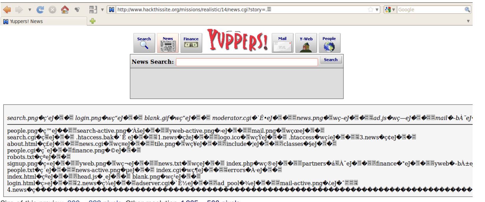
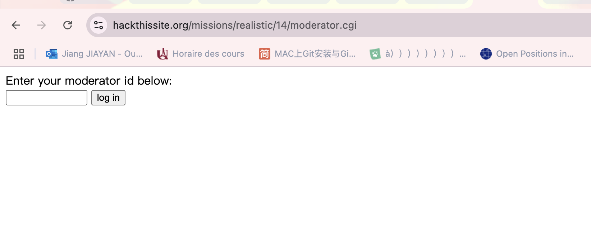
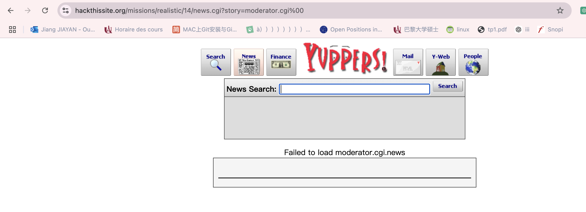
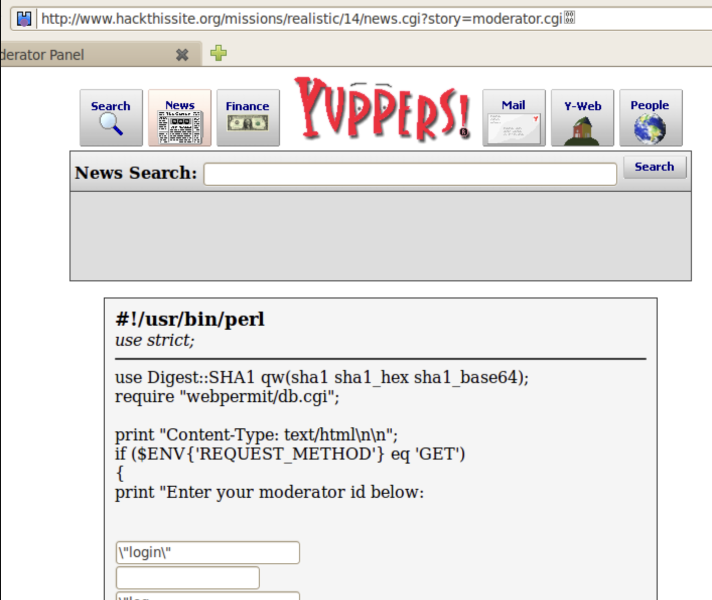
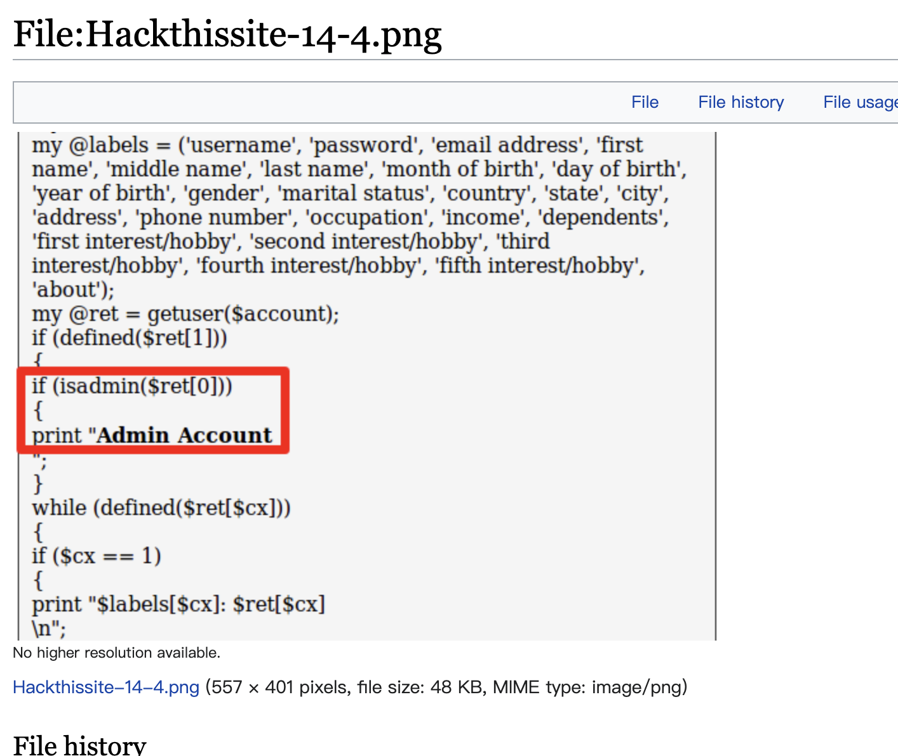
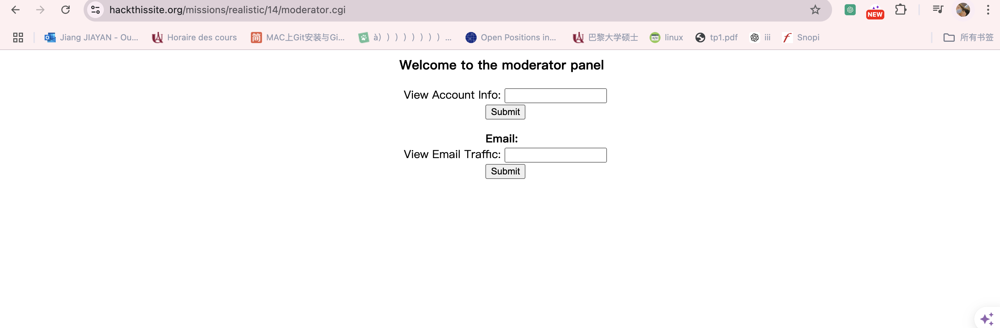
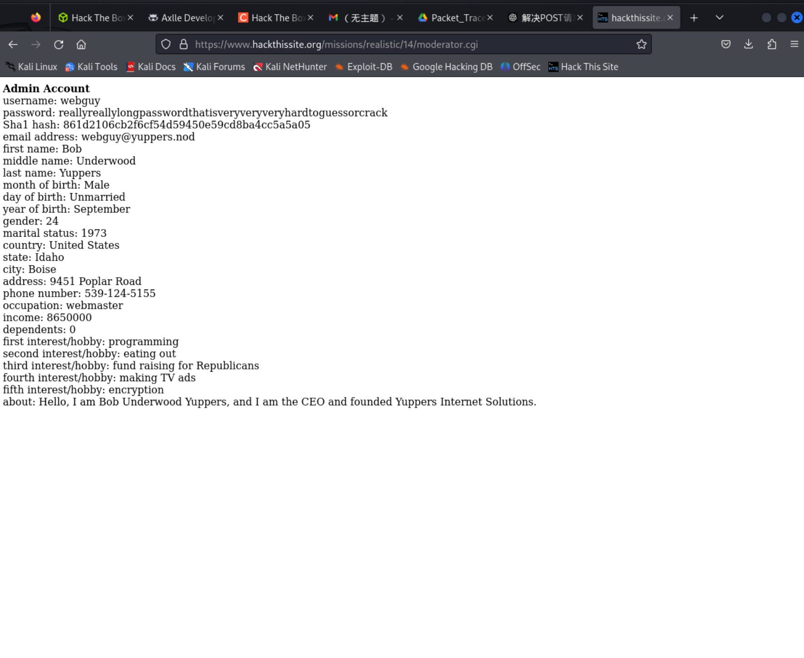
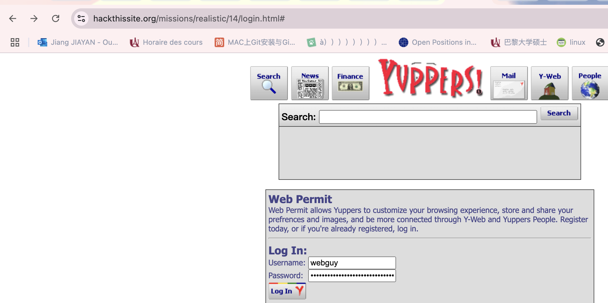
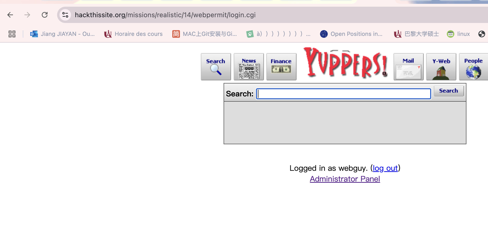

## 14.Yuppers Internet Solutions

Message: You've probably heard of Yuppers Internet Solutions before.
They started in 1997 and are now one of the top websites on the net. 
I was an intern at Yuppers for a time, but quit when I learned that the admins were selling user data and usage habits to advertisers while saying the opposite. 
Unfortunately, I couldn't get out of the building with any proof and don't have any high-level access.
I do know, however, that much of the coding on their site was done by amateurs and is probably insecure. Can you hack in and get some proof?

#### Trouver un compte administrateur

Pour trouver un accès, on tente de nombreuses injections dans les champs du formulaire (la méthode GET est plus simple). Nous pouvons voir que le lecteur de news (news.cgi) accepte un paramètre nommé "story". En injectant un point et un octet nul (.%00).

Dans des conditions normales, cette fonctionnalité consiste essentiellement à charger un fichier. Et si nous pouvions modifier l'URL pour dire au backend d'ignorer la partie .news ? Que se passerait-il ? C'est là qu'intervient l'entrée d'octet nul.

#### A null byte injection 
Involves a user providing an input which, once decoded, resolves to a null byte. On the backend, if unfiltered, this will cause the backend system to stop processing the string containing the user input. This abrupt termination can cause unusual and unexpected behavior in the application.

#### Utilisation d'une entrée d'octet nul pour répertorier le contenu du répertoire
Lorsque cette partie de la mission fonctionnait encore, accéder à notre URL contenant l'octet nul nous aurait donné une page contenant un tas de code backend non destiné au frontend.

C'est difficile à déchiffrer, mais cette sortie répertorie l'arborescence des répertoires du site. 
Ceci est similaire à ce que nous avons pu faire en utilisant une injection SQL dans [insérer les missions].

Deux fichiers se démarquent : Administrator.cgi et Moderator.cgi. 
Si vous essayez d'accéder à https://www.hackthissite.org/missions/realistic/14/adminstrator.cgi, 
vous obtiendrez une erreur 404 indiquant que cette page n'existe pas et n'a jamais existé. 
Il serait plus convaincant si cette page n'était pas clairement répertoriée dans l'arborescence des répertoires, 
donc s'il y a vraiment une page ici, nous ne pouvons pas y accéder pour le moment.
L'accès à https://www.hackthissite.org/missions/realistic/14/moderator.cgi, q
uant à lui, nous amène à un formulaire qui nous oblige à fournir un identifiant de modérateur. C'est prometteur, 
et clairement quelque chose que les utilisateurs ordinaires de Yuppers ne devraient pas avoir accès, 
mais nous ne savons pas comment procéder. Si seulement nous pouvions en apprendre davantage sur ce script moderator.cgi.

#### Utilisation d'une entrée d'octet nul pour lire des fichiers

Nous avons déjà utilisé une entrée d'octet nul pour manipuler https://www.hackthissite.org/missions/realistic/14/news.cgi?story= afin de répertorier le contenu du répertoire. 

Pouvons-nous l'utiliser pour afficher le contenu d'un fichier ? Oui – du moins à l’époque où la mission fonctionnait correctement.

Tout ce que nous avions à faire était d'essayer d'accéder à https://www.hackthissite.org/missions/realistic/14/news.cgi?story=moderator.cgi%00. 

Compte tenu de ce que nous avons déjà découvert sur la vulnérabilité de ce site aux entrées d'octets nuls, 
il n'est pas difficile d'imaginer ce qui s'est passé sur le backend.
En bref, en utilisant l'entrée d'octet nul pour terminer le traitement de la chaîne, nous empêchons le backend d'apposer .news à la fin de notre entrée moderator.cgi. 
Cela amènerait le backend à lire littéralement le contenu de moderator.cgi et à imprimer son contenu sur le frontend.

#### Contourner les privilèges de sécurité

nous aurions dû faire une analyse du code et des messages d'erreur. Il y aurait un bloc de code qui se démarquerait vraiment :

`
if (isadmin($ret[0]))
{
print "Admin Account
";
}

`
isadmin est une valeur associée aux comptes d'administrateur, dont nous essayons d'identifier et d'accéder. 
C'est peut-être quelque chose que nous pouvons usurper sur la page de recherche du modérateur. 
Si nous revenons sur https://www.hackthissite.org/missions/realistic/14/moderator.cgi, saisissons isadmin dans le champ de recherche et sélectionnons se connecter, cela nous amène au panneau de modération de Yuppers.

Le panneau du modérateur nous permet d'afficher les informations de compte pour un nom d'utilisateur de compte donné, 
ou le trafic de messagerie pour une adresse e-mail donnée. 
Mais il s’avère qu’il existe un défaut d’une simplicité trompeuse dans la recherche d’informations sur le compte.
La saisie de * est l'équivalent d'une instruction SQL SELECT * sur le backend et répertoriera les informations de tous les comptes administrateur.
Entrez * dans la zone Afficher les informations sur le compte, cliquez sur Soumettre, et nous avons besoin des informations de notre nom d'utilisateur et de notre mot de passe administrateur.

#### login 

`
username: webguy
password: reallyreallylongpasswordthatisveryveryveryhardtoguessorcrack
`
https://www.hackthissite.org/missions/realistic/14/login.html#

