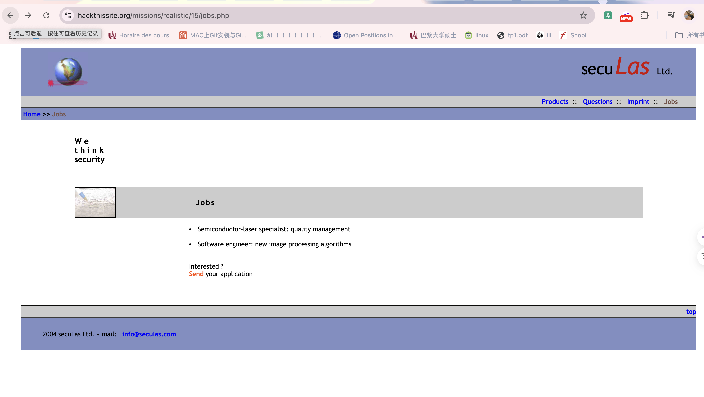
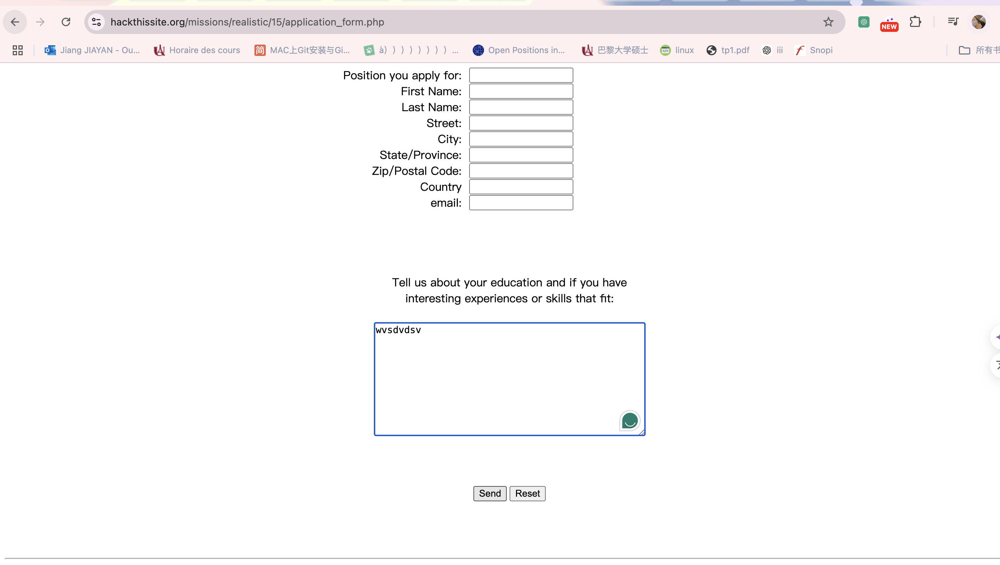
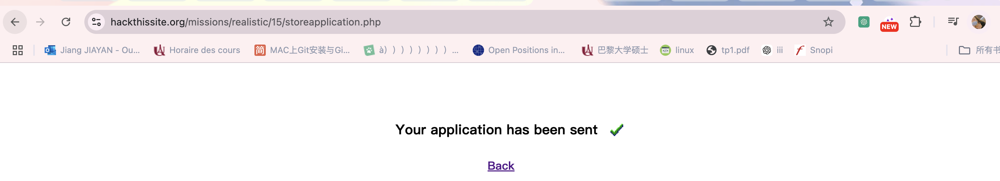
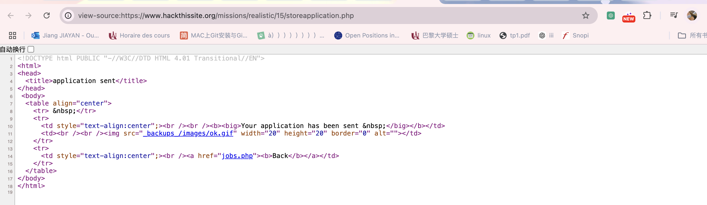
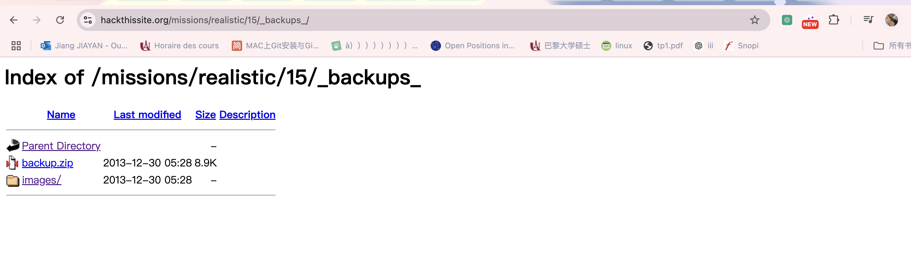
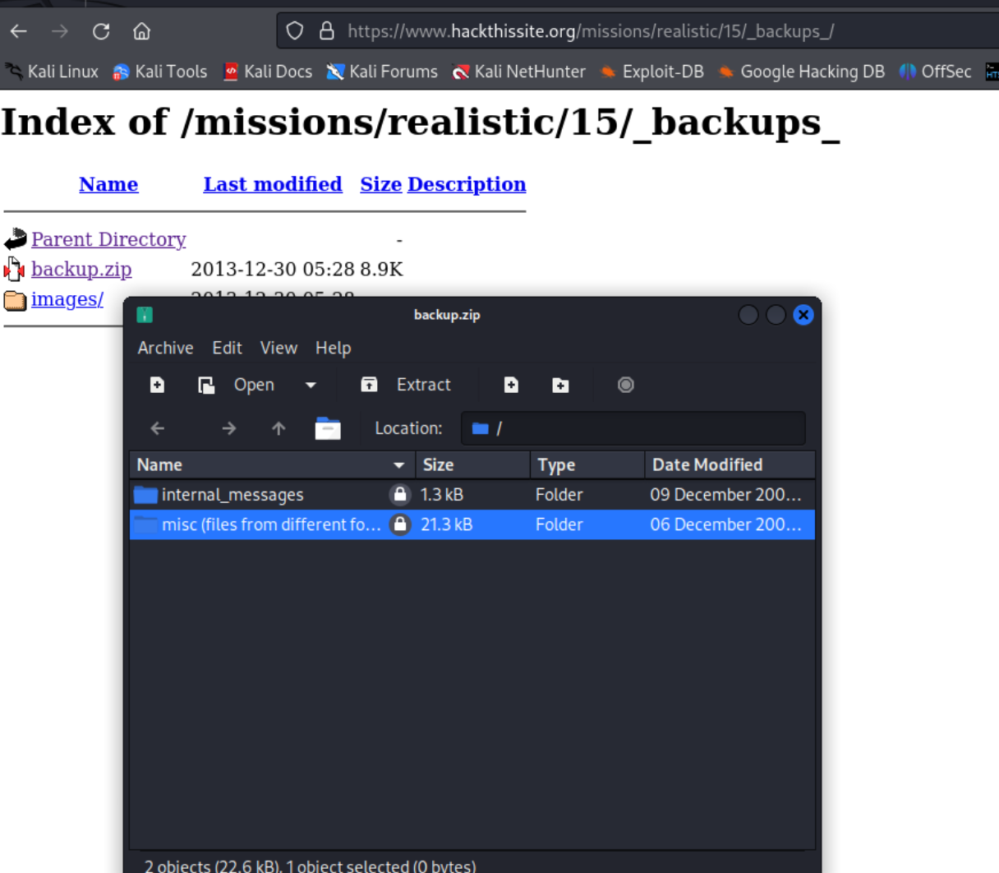
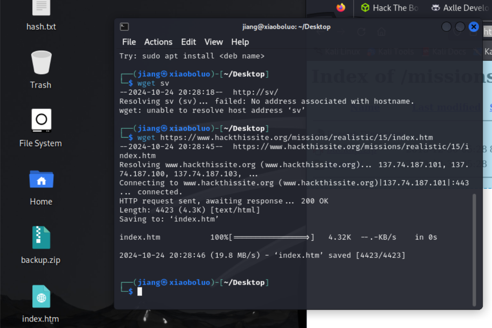

## 15.seculas Ltd.
Message: Hi, I think my girlfriend is cheating on me! But I can't find proof for it. I know she uses SimpleMail, and it's quite new, so you might be able to hack it. Please! I really need to know if she is cheating on me, so I could move on. Chances are, SimpleMail will be VERY secure, but I believe that you could do it!

Just in case you're stuck, I've done some researches about it, and found some interesting comments in the source. Good luck!


Please save a heart, if not a relationship.

Oh yeah, her email is jenn@simplemail.com

### Détails de la disposition du site
La clé de la mission réside dans la page **Jobs** (Recrutement). 





En cliquant sur le lien pour envoyer une candidature, vous serez redirigé vers une autre page, 
et après avoir soumis le formulaire, vous serez redirigé vers une nouvelle page. 
Si vous examinez le code source de ces pages, vous remarquerez que la page `storeapplication.php` charge une image de case à cocher verte enregistrée sous `_backups_/images/ok.gif`. Le répertoire **backups** est un nouveau répertoire qui mérite d'être exploré.





### Accès au fichier de sauvegarde

#### Télécharger le fichier
Naviguez vers le nouveau répertoire `_backups_`. Dans ce répertoire, il y a un dossier `images/` contenant quelques fichiers, comme l'image de la case à cocher verte que nous avons vue sur la page `storeapplication.php`, ainsi qu'un fichier `backup.zip`. Téléchargez ce fichier et essayez de l'ouvrir. Malheureusement, ce fichier est protégé par un mot de passe.



#### Visualiser le contenu de l'archive
En guise d'étape initiale, nous pouvons utiliser la ligne de commande pour visualiser le contenu de l'archive. Rendez-vous dans le répertoire où vous avez enregistré `backup.zip`, puis exécutez la commande `unzip -l backup.zip`.

Vous devriez obtenir un résultat similaire à ceci :

```sql
  Length      Date    Time    Name
---------  ---------- -----   ----
        0  12-08-2004 12:55   internal_messages/
      336  12-08-2004 12:44   internal_messages/msgshow.php
      965  12-11-2004 07:02   internal_messages/msgauth.php
        0  12-05-2004 09:51   misc (files from different folders)/
     4423  12-04-2004 09:41   misc (files from different folders)/index.htm
    16860  12-05-2004 09:51   misc (files from different folders)/shell.php
---------                     -------
    22584                     6 files

Malheureusement, l'URL `https://www.hackthissite.org/missions/realistic/15/internal_messages/` renvoie une erreur de page non trouvée. Cependant, si vous vérifiez l'activité réseau dans les outils de développement de votre navigateur, vous constaterez que cette page renvoie en réalité un code d'état `403 Forbidden`. Cela indique que ce répertoire existe bien, mais que nous ne pouvons pas y accéder directement via le navigateur.

Pour consulter le code source de ces fichiers, nous devons déchiffrer l'archive `backup.zip`, ce qui nécessite l'utilisation d'un programme spécifique.

### Utiliser PkCrack pour déchiffrer le fichier de sauvegarde
Les fichiers compressés (comme `backup.zip`) utilisent un algorithme de compression prévisible pour réduire la taille des fichiers. Cette prévisibilité nous permet, à l'aide d'outils comme **PkCrack**, de déchiffrer des fichiers compressés protégés par mot de passe. Pour cela, il nous faut deux éléments : une version non compressée d'un fichier présent dans l'archive, ainsi que sa version compressée.

Heureusement, le fichier `index.htm` dans `backup.zip` est probablement identique à celui présent sur le site. Nous pouvons récupérer ce fichier `index.htm` depuis le site et utiliser l'outil **wget** pour le télécharger, en vérifiant que sa taille est bien de 4423 octets.

#### Utiliser wget pour sauvegarder `index.htm`
Utilisez la commande `wget` pour télécharger le fichier `index.htm` depuis le site et vérifiez que le fichier téléchargé a bien une taille de 4423 octets :

```bash
wget https://www.hackthissite.org/missions/realistic/15/index.htm



