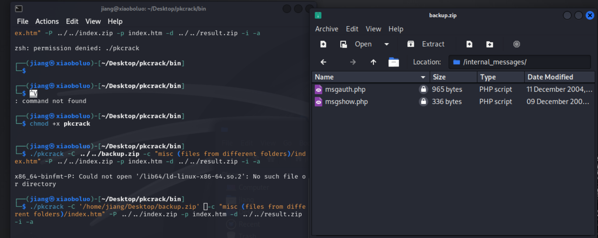
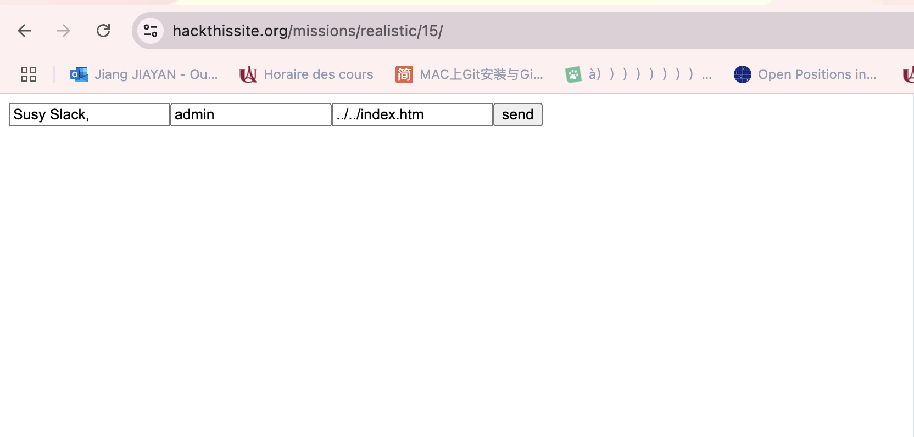
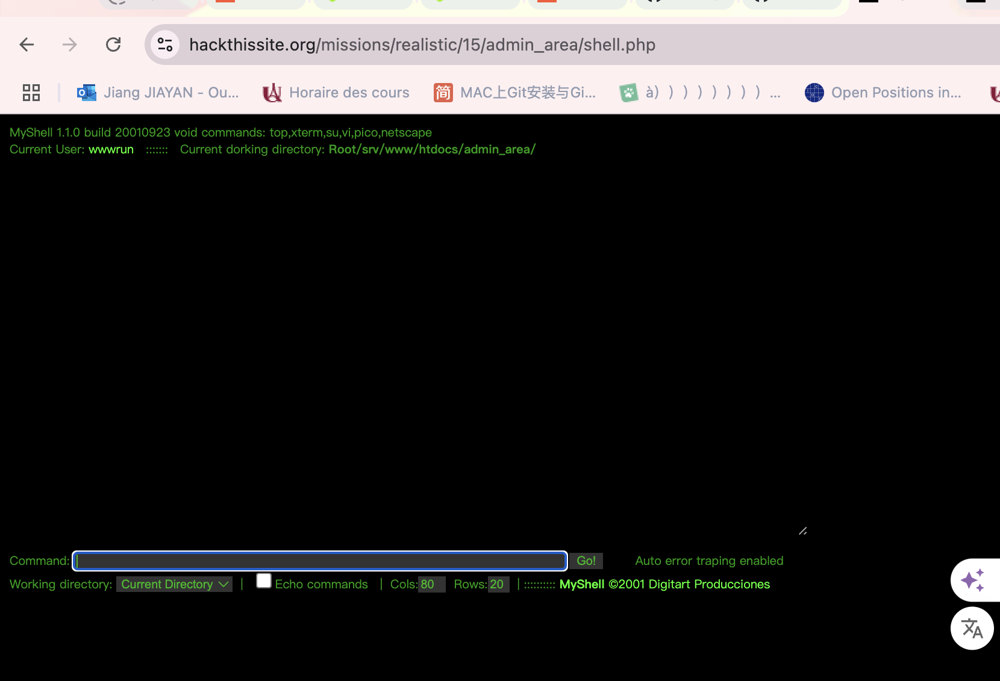
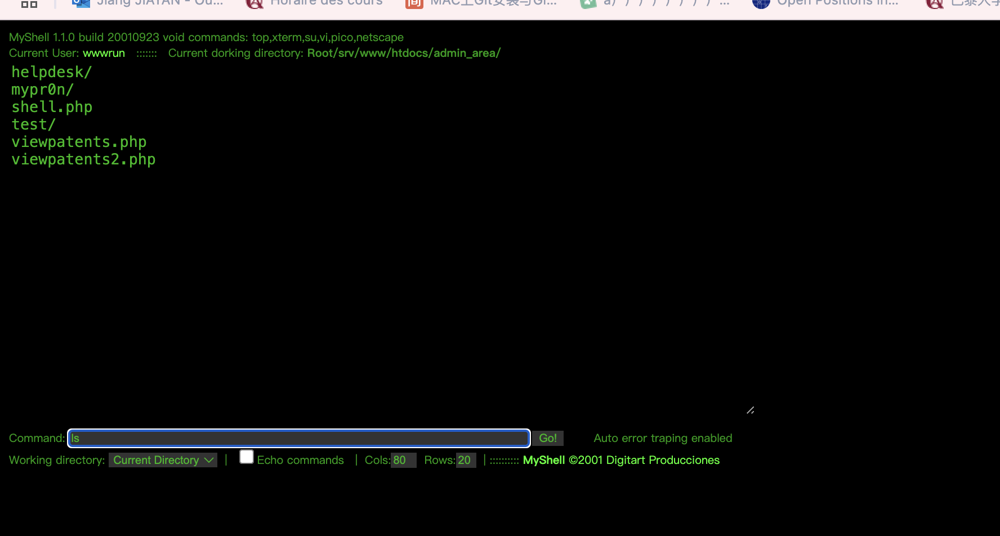
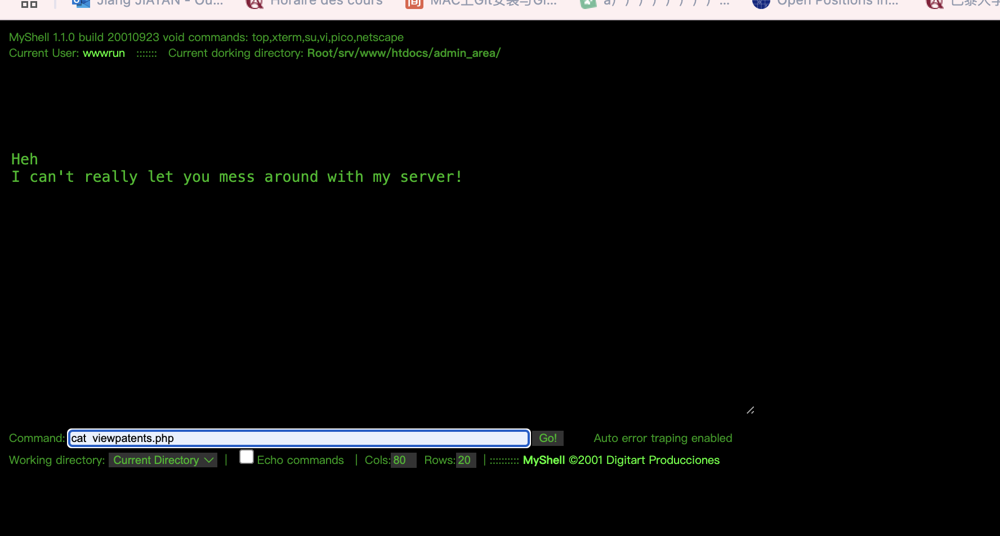
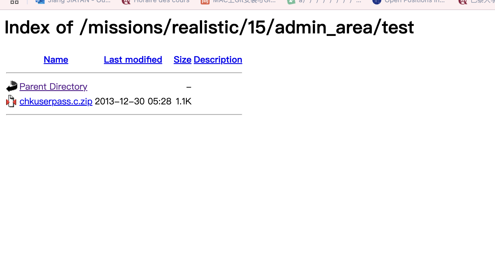
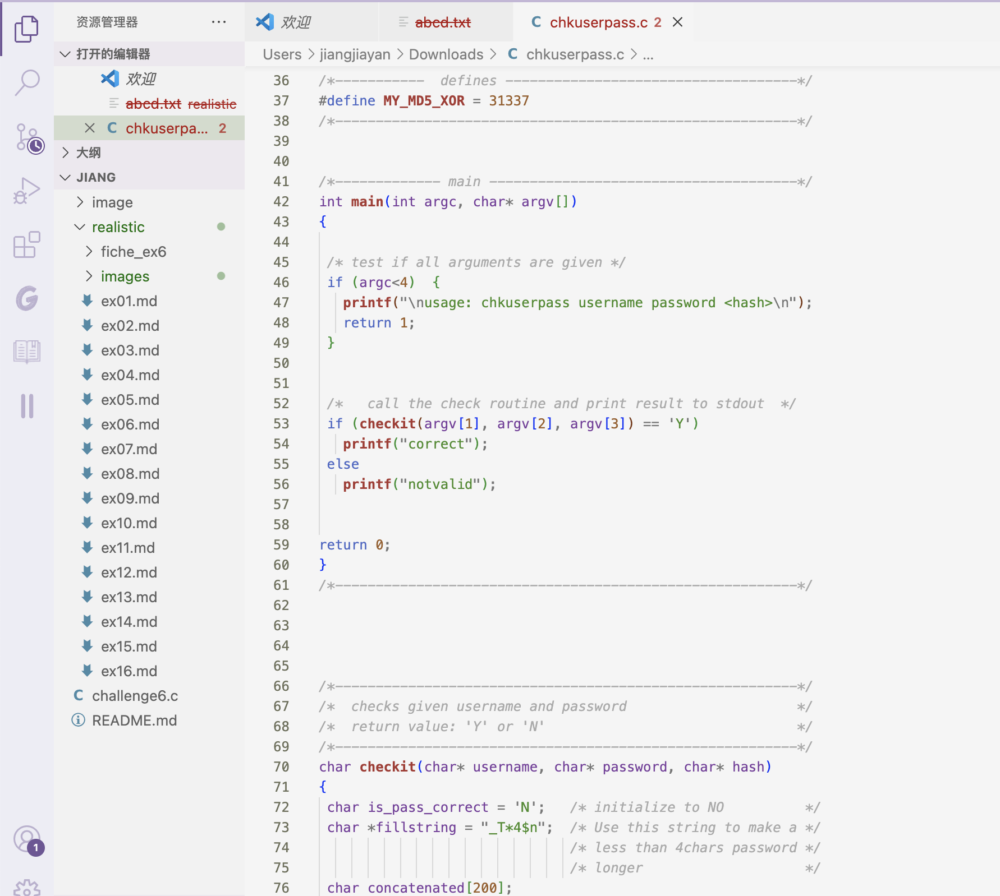
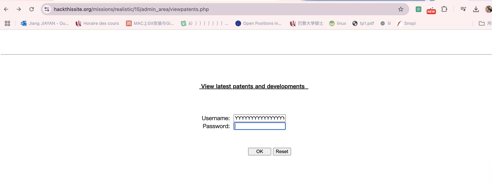
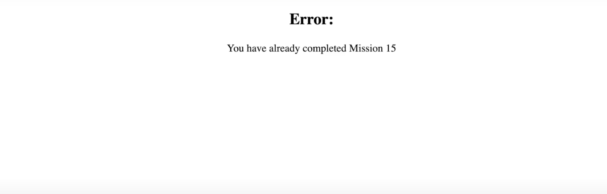

## 15.seculas Ltd.
Message: Hi, I think my girlfriend is cheating on me! But I can't find proof for it. I know she uses SimpleMail, and it's quite new, so you might be able to hack it. Please! I really need to know if she is cheating on me, so I could move on. Chances are, SimpleMail will be VERY secure, but I believe that you could do it!

Just in case you're stuck, I've done some researches about it, and found some interesting comments in the source. Good luck!


Please save a heart, if not a relationship.

Oh yeah, her email is jenn@simplemail.com

### Détails de la disposition du site
La clé de la mission réside dans la page **Jobs** (Recrutement). 


En cliquant sur le lien pour envoyer une candidature, vous serez redirigé vers une autre page, 
et après avoir soumis le formulaire, vous serez redirigé vers une nouvelle page. 
Si vous examinez le code source de ces pages, vous remarquerez que la page `storeapplication.php` charge une image de case à cocher verte enregistrée sous `_backups_/images/ok.gif`. Le répertoire **backups** est un nouveau répertoire qui mérite d'être exploré.


### Accès au fichier de sauvegarde

#### Télécharger le fichier
Naviguez vers le nouveau répertoire `_backups_`. Dans ce répertoire, il y a un dossier `images/` contenant quelques fichiers, comme l'image de la case à cocher verte que nous avons vue sur la page `storeapplication.php`, ainsi qu'un fichier `backup.zip`. Téléchargez ce fichier et essayez de l'ouvrir. Malheureusement, ce fichier est protégé par un mot de passe.


#### Visualiser le contenu de l'archive
En guise d'étape initiale, nous pouvons utiliser la ligne de commande pour visualiser le contenu de l'archive. Rendez-vous dans le répertoire où vous avez enregistré `backup.zip`, puis exécutez la commande `unzip -l backup.zip`.

Vous devriez obtenir un résultat similaire à ceci :

```sql
  Length      Date    Time    Name
---------  ---------- -----   ----
        0  12-08-2004 12:55   internal_messages/
      336  12-08-2004 12:44   internal_messages/msgshow.php
      965  12-11-2004 07:02   internal_messages/msgauth.php
        0  12-05-2004 09:51   misc (files from different folders)/
     4423  12-04-2004 09:41   misc (files from different folders)/index.htm
    16860  12-05-2004 09:51   misc (files from different folders)/shell.php
---------                     -------
    22584                     6 files
```
Malheureusement, l'URL `https://www.hackthissite.org/missions/realistic/15/internal_messages/` renvoie une erreur de page non trouvée. Cependant, si vous vérifiez l'activité réseau dans les outils de développement de votre navigateur, vous constaterez que cette page renvoie en réalité un code d'état `403 Forbidden`. Cela indique que ce répertoire existe bien, mais que nous ne pouvons pas y accéder directement via le navigateur.

Pour consulter le code source de ces fichiers, nous devons déchiffrer l'archive `backup.zip`, ce qui nécessite l'utilisation d'un programme spécifique.

### Utiliser PkCrack pour déchiffrer le fichier de sauvegarde
Les fichiers compressés (comme `backup.zip`) utilisent un algorithme de compression prévisible pour réduire la taille des fichiers. Cette prévisibilité nous permet, à l'aide d'outils comme **PkCrack**, de déchiffrer des fichiers compressés protégés par mot de passe. Pour cela, il nous faut deux éléments : une version non compressée d'un fichier présent dans l'archive, ainsi que sa version compressée.

Heureusement, le fichier `index.htm` dans `backup.zip` est probablement identique à celui présent sur le site. Nous pouvons récupérer ce fichier `index.htm` depuis le site et utiliser l'outil **wget** pour le télécharger, en vérifiant que sa taille est bien de 4423 octets.

#### Utiliser wget pour sauvegarder `index.htm`
Utilisez la commande `wget` pour télécharger le fichier `index.htm` depuis le site et vérifiez que le fichier téléchargé a bien une taille de 4423 octets :

```bash
wget https://www.hackthissite.org/missions/realistic/15/index.htm
```


### Téléchargement et installation de PkCrack

Ensuite, téléchargez et installez **PkCrack**. Suivez les instructions pour compiler PkCrack, puis utilisez la commande suivante pour déchiffrer l'archive compressée :

```bash
./pkcrack -C ../../backup.zip -c "misc (files from different folders)/index.htm" -P ../../index.zip -p index.htm -d ../../result.zip -i -a
```


### Accéder au système de messages internes

#### Working Through msgshow.php and msgauth.php's Logic

### Accéder au système de messages internes

Après avoir décompressé les fichiers, nous obtenons les fichiers `msgshow.php` et `msgauth.php`. En examinant le code source de ces fichiers, on peut découvrir leur logique et identifier des vulnérabilités. Le fichier `msgauth.php` lit un fichier (comme `msgpasswords.txt`) pour vérifier les noms d'utilisateur et les mots de passe.

Nous pouvons utiliser une injection **JavaScript** pour soumettre des données à `msgauth.php` et simuler une connexion administrateur :

```javascript
document.write('<form action="https://www.hackthissite.org/missions/realistic/15/internal_messages/msgauth.php" method="POST"><input name="msg_password" value="Susy Slack," type="text"><input name="msg_username" value="admin" type="text"><input name="filename" value="../../index.htm" type=text><input type="submit" value="send"></form>')
```


Après avoir soumis le formulaire, le système affichera set admin OK, ce qui signifie que vous vous êtes correctement défini en tant qu'administrateur.

### Accès à `admin_area/` et décryptage de la connexion

La zone d'administration est protégée, nous devons donc analyser plus en profondeur le fichier `shell.php`. En exploitant une vulnérabilité d'injection de nom de variable, il est possible de récupérer le mot de passe administrateur crypté et de le déchiffrer. Enfin, en utilisant le nom d'utilisateur `root` et le mot de passe déchiffré (comme `foobar`), on peut se connecter à la zone d'administration.
### Accès à `admin_area/`

Le message que nous pouvons maintenant lire nous parle d'un autre répertoire sur le site, `admin_area/`. Si nous allons directement à `https://www.hackthissite.org/missions/realistic/15/admin_area/`, nous obtenons un message "Forbidden" dans le navigateur. Cependant, comme avec certaines des pages que nous avons déjà consultées, nous obtenons un code de statut `200 OK`. Cela signifie que ce répertoire existe bien. En revenant à notre archive de sauvegarde décryptée, il y a un fichier que nous n'avons pas encore trouvé sur le site en direct et qui est mentionné dans le message que nous venons de lire : `shell.php`. Essayons d'accéder à `https://www.hackthissite.org/missions/realistic/15/admin_area/shell.php`, une fenêtre de connexion apparaît. Des entrées évidentes comme `admin` et `password` ne fonctionnent pas, et lorsque vous cliquez sur "Annuler", vous êtes redirigé vers une page "Access Denied".

Nous n'avons pas encore regardé le fichier `shell.php` de l'archive décryptée, il est donc temps de le faire. Les lignes 42 et 43 se distinguent immédiatement : il y a un nom d'utilisateur `root` et un mot de passe, mais le mot de passe a été retiré de l'archive de sauvegarde. Il semble également être haché.

Je n'étais pas sûr de ce qu'il fallait chercher, donc j'ai recherché des fichiers shell avec la même version de `MyShell` pour voir si des fichiers similaires étaient disponibles sur le web. J'en ai trouvé un ici. J'ai remarqué une différence importante entre notre fichier `shell.php` et la version que j'ai trouvée en ligne. Lorsque vous comparez la ligne 123 de `shell.php` à la ligne 110 de la version en ligne, la ligne 123 de `shell.php` contient ceci : 

```php
$MyShellVersion =  "MyShell 1.1.0 build 20010923 ".$$PHP_AUTH_USER;
```

Cela peut sembler sans importance, mais c'est une faille grave. Le caractère `$` supplémentaire fait que le programme affiche la valeur d'une variable si vous fournissez un nom de variable en tant que nom d'utilisateur.

Vous pouvez essayer de saisir `adminEmail` dans la fenêtre de connexion qui s'affiche, cliquer sur "OK", puis cliquer à nouveau sur "Annuler". La dernière ligne de la page d'erreur "Access Denied" affichera `admin@seculas.com`. Alors, que se passe-t-il si nous essayons `shellPswd_root` ? Pouvons-nous obtenir le mot de passe haché ?

Le résultat est positif. Dans le champ du nom d'utilisateur, entrez `shellPswd_root`, cliquez sur "OK", puis cliquez sur "Annuler". La dernière ligne du message "Access Denied" affiche maintenant le mot de passe haché que nous avons obtenu. Si vous regardez la ligne 126 du fichier `shell.php`, vous remarquerez que ce hachage est un double hachage MD5. Cela signifie qu'autrefois, nous aurions dû utiliser des outils comme **John the Ripper** ou **Hashcat** pour attaquer ce hachage deux fois afin d'obtenir le mot de passe en clair. Mais comme ce hachage existe depuis un certain temps, il a déjà été cassé. **CrackStation** identifie rapidement ce hachage et nous dit qu'il se résout en `foobar`. Utilisez `root` et `foobar` comme identifiants pour vous connecter à `admin_area/`.



**Remarque** : Je n'ai pas pu faire apparaître le hachage `shellPswd_root` en utilisant Chrome. Peut-être que Chrome dispose d'un filtrage intégré pour empêcher la faille de devenir visible en frontend. Mais cette étape a fonctionné comme prévu dans Firefox.

### Navigation dans l'interface Shell

Nous avons réussi à nous connecter, et nous avons maintenant une interface web shell que nous pouvons utiliser. Cette interface fonctionne comme un shell sur notre machine locale, nous pouvons donc exécuter la commande `ls` pour voir les fichiers et répertoires présents. Nous voyons qu'il y a une page `viewpatents.php`. 



Cependant, lorsque nous tentons d'accéder à cette page via 

`https://www.hackthissite.org/missions/realistic/15/admin_area/viewpatents.php` 

elle est protégée par un autre portail de connexion.



Le shell nous montre qu'il existe un autre répertoire `test/`, donc nous accédons à 

`https://www.hackthissite.org/missions/realistic/15/admin_area/test/`. 

Le listing des répertoires est activé, et nous pouvons voir un fichier `chkuserpass.c.zip`. Téléchargez-le, décompressez-le et ouvrez le fichier.





### Attaque par dépassement de tampon

Le fichier que nous examinons fournit une vérification d'authentification supplémentaire pour les utilisateurs qui tentent d'accéder aux informations brevetées de Seculas. La clé réside dans la fonctionnalité `checkit`, qui examine le nom d'utilisateur, le mot de passe et le hash du mot de passe de l'utilisateur, puis renvoie une valeur `Y` ou `N`. En fonction de cette valeur, le backend décide s'il accorde ou non l'accès à l'utilisateur.

Il y a une vulnérabilité dans ce script liée à la variable concaténée `char`. Elle est configurée pour contenir une valeur de 200 caractères sans gestion des erreurs si la valeur dépasse cette limite. Cela signifie que la variable `concatenated` est vulnérable à une attaque par dépassement de tampon. Si nous fournissons un nom d'utilisateur qui dépasse 200 caractères, cela pourrait submerger le script et entraîner des effets indésirables.

Dans notre situation, nous voulons forcer `checkit` à renvoyer une valeur `Y`. Pour ce faire, il suffit de fournir une chaîne de caractères de plus de 200 `Y` en tant que nom d'utilisateur. Cela submergera la mémoire du système backend et accordera accidentellement l'accès à la section des brevets.



Il m'a fallu plusieurs essais, mais une chaîne de 228 `Y` en tant que nom d'utilisateur a fonctionné. Cliquez sur OK et vous aurez terminé la mission.


