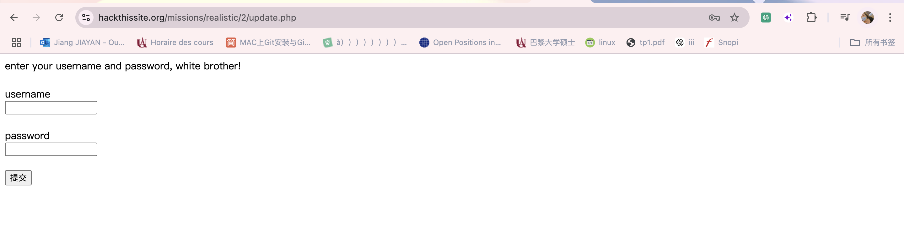

## 2.Chicago American Nazi Party

### Méthod:injection SQL

1.Lorsqu‘on ouvert une page web sans aucun lien pour les prochaines étapes,
on peux inspecter le code source et y trouver un fichier PHP.
Pour l'exécuter, essayez d'ajouter ce fichier à l'URL dans la barre d'adresse du navigateur et rechargez la page.

Il semble qu'il y ait une injection SQL ici. Nous essayons d'utiliser "1=1", 
en donnant à la base de données une équation toujours vraie, pour voir si cela permet de contourner la vérification du mot de passe.

avec `admin 1' or 1=1 --+`
on a réussi .

### why `admin 1' or 1=1 --+`

