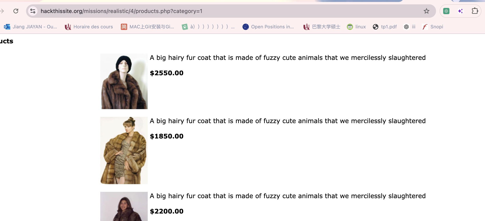

## 4.Fischer's Animal Products

### Méthod : injection de SQL par UNION
Résumé de injection de SQL par UNION:

Une attaque par UNION en SQL est une méthode utilisée dans le cadre d'une injection SQL pour cibler une base de données.
L'attaquant exploite le mot-clé UNION pour combiner plusieurs résultats de requêtes en une seule réponse, lui permettant ainsi de récupérer des informations sensibles depuis la base de données. 
Cette technique est particulièrement utilisée lorsque les résultats d'une requête ne révèlent pas directement des données critiques.

En utilisant l'UNION, l'attaquant peut forcer l'inclusion d'autres tables ou colonnes dans la réponse et ainsi obtenir des informations qu'il n'était pas censé voir.
Le principe de cette attaque repose sur l'insertion d'une requête malveillante dans un champ de saisie ou une URL vulnérable, 
et l'ajout d'une clause UNION SELECT. Cela permet de récupérer des informations issues d'autres tables ou d'autres colonnes dans la même base de données, 
comme des identifiants d'utilisateurs, des mots de passe ou des données personnelles. Pour que l'attaque fonctionne, 
la structure des colonnes dans la requête initiale doit correspondre à celle de la requête injectée via l'UNION, ce qui implique souvent une série de tests pour ajuster cette correspondance.

En résumé, l'attaque UNION SQL est une technique sophistiquée d'injection SQL permettant à un attaquant de contourner les restrictions de sécurité en combinant des résultats de plusieurs requêtes, exposant ainsi des données qui ne devaient normalement pas être accessibles.

### Résoudre le problème 
On regarde deux liens sur cette page ""Fur Coats!"" et "Alligator Accessories!"

Lorsque je clique sur le premier lien, je peux voir dans l'URL l'apparition de category=1. 
Cela semble être le résultat d'une recherche dans une base de données, et par conséquent, 
il est possible qu'il existe une vulnérabilité à une attaque par injection SQL.

En utilisant `ORDER BY`, nous pouvons avoir une idée approximative de la structure de la table des produits.
La commande `ORDER BY 1` DESC inverse l'ordre du contenu de la page selon les images. 
Cela indique que le type de données des images correspond à la première colonne de la table des produits.

et `order by 2 desc` n'a pas changé le contenu de la page.
Mais il y a une chaîne commune, 'A big hairy fur coat that is made of fuzzy cute animals that we mercilessly slaughtered' 
dans chaque description de produit, ce qui signifie que la description du produit est probablement la deuxième colonne. 
C'est un type de données chaîne de caractères.

et https://www.hackthissite.org/missions/realistic/4/products.php?category=1%20ORDER%20BY%203%20DESC et https://www.hackthissite.org/missions/realistic/4/products.php?category=1%20ORDER%20BY%203%20ASC trient par prix. Cela signifie que le prix est probablement la troisième colonne, probablement aussi sous forme de chaîne de caractères.
et https://www.hackthissite.org/missions/realistic/4/products.php?category=1%20ORDER%20BY%20420DESC et https://www.hackthissite.org/missions/realistic/4/products.php?category=1%20ORDER%20BY%20420ASC n'ont encore une fois pas changé l'ordre de tri. Cependant, de nombreuses tables SQL ont une colonne d'identification (ID), donc peut-être que c'est celle-ci.

`order by 5 desc`a renvoyé l'icône de l'image cassée. Je pense que cela signifie qu'il n'y a pas de cinquième colonne. Le tableau des produits ne comporte que quatre colonnes, ce qui est logique.

Utilisez `*` pour afficher toutes les données de la séquence actuelle, 
et nous savons que l'email se trouve forcément dans l'une des quatre colonnes. 
Commencez par la première colonne et définissez les autres colonnes sur `null`.

Lorsqu'on a essayé avec la deuxième colonne, nous avons vu la liste complète des emails.

