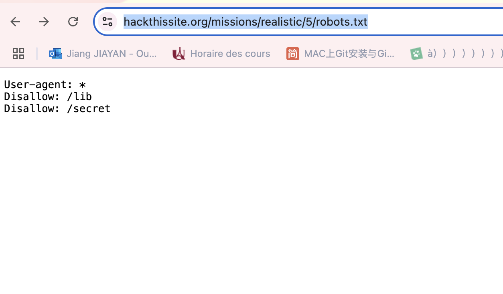
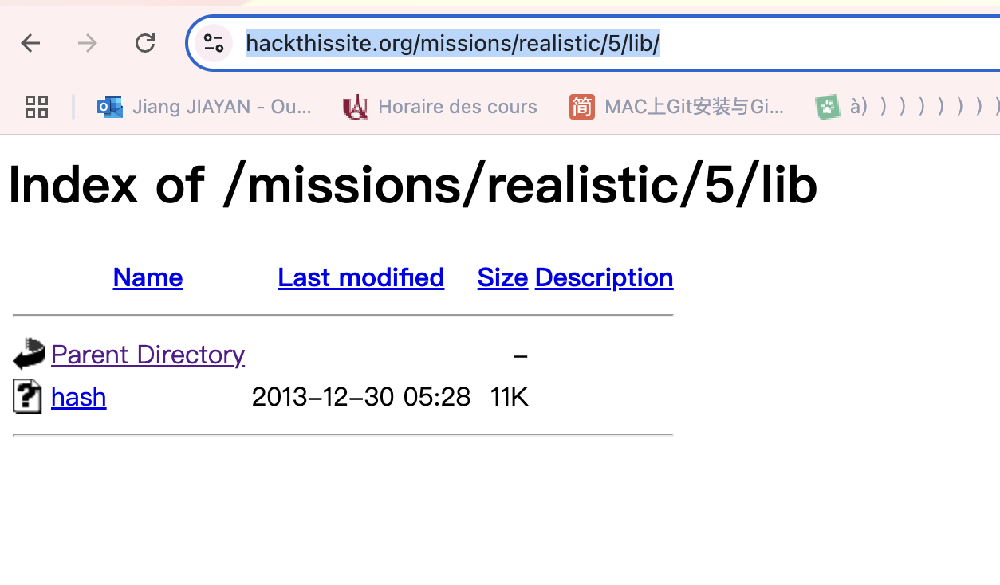
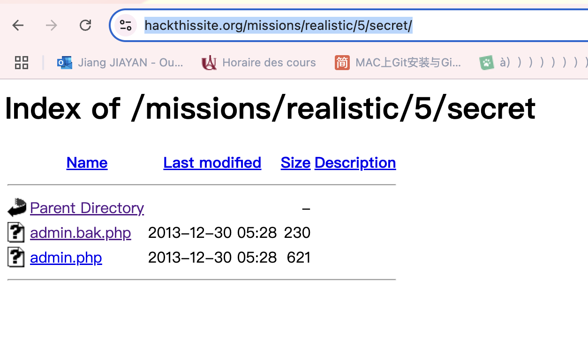
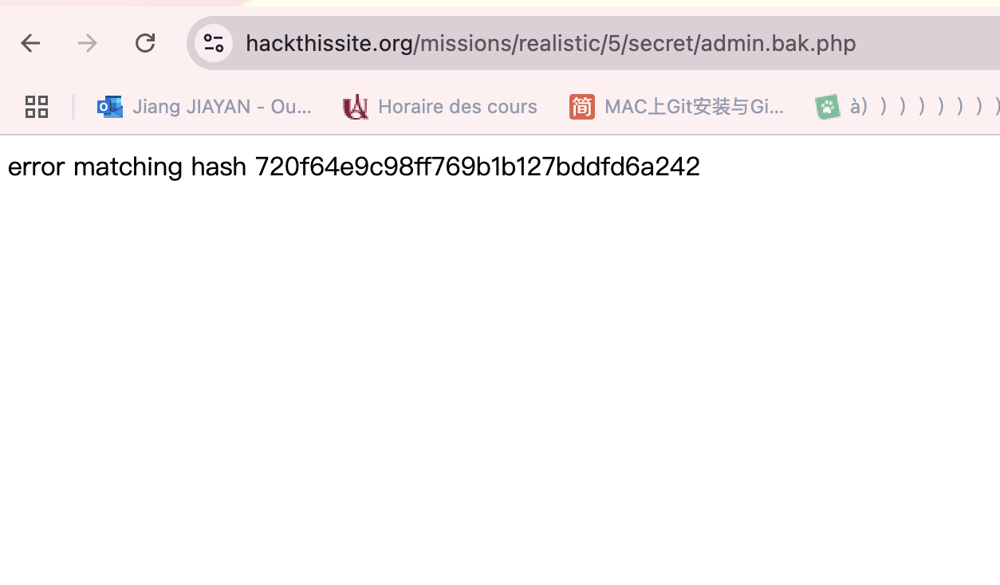
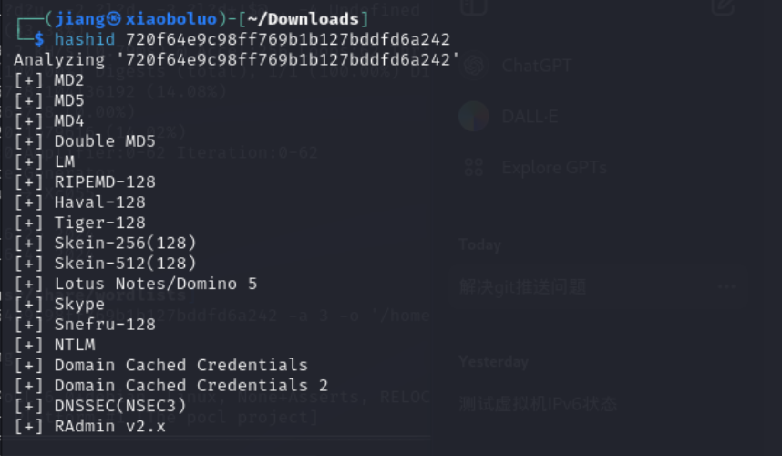
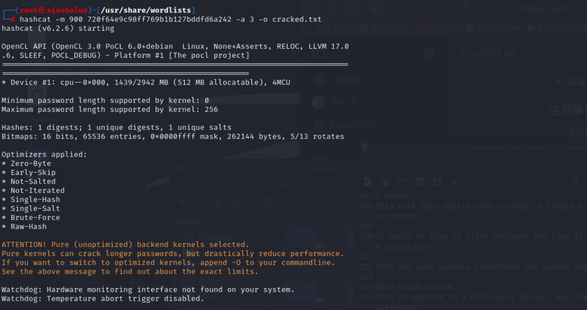
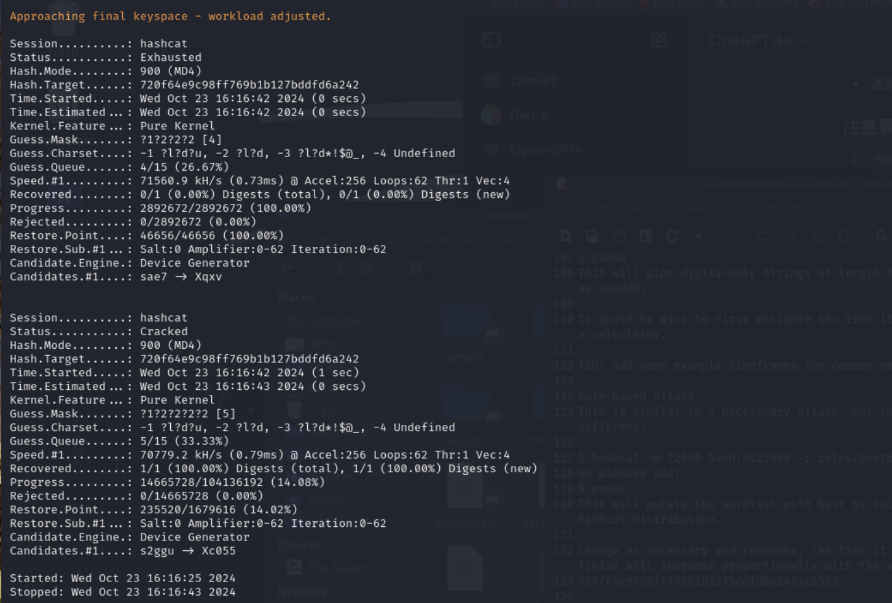
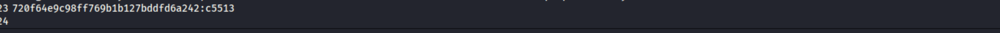
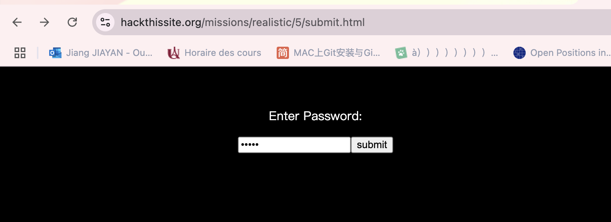
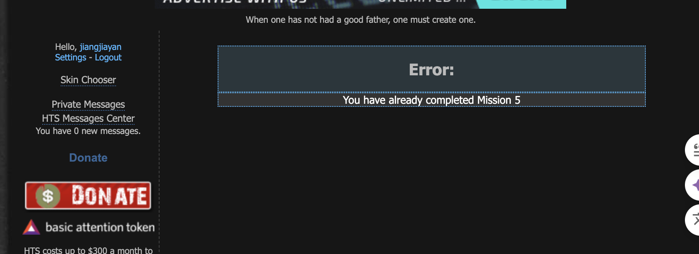

## 5.Damn Telemarketers!

### Méthod : Hash, root.txt

1. https://www.hackthissite.org/missions/realistic/5/robots.txt :trouvé les fichiers cachés 

2. https://www.hackthissite.org/missions/realistic/5/lib/

https://www.hackthissite.org/missions/realistic/5/secret/

3.https://www.hackthissite.org/missions/realistic/5/secret/admin.bak.php

`hash 720f64e9c98ff769b1b127bddfd6a242`

4.On fait analyse de la suite `720f64e9c98ff769b1b127bddfd6a242` pour vérifier laquelle méthod de hash

`hashid 720f64e9c98ff769b1b127bddfd6a242`

5. Décryptage de la suite hash avec l’outil `hashcat`

 `hashcat -m 900 720f64e9c98ff769b1b127bddfd6a242 - a 3 -o hash.txt`
 -m 900 : il représente la méthod crypto hash MD4
 -a 3 : il représente la méthode d’attaque 'Brute-Force '
 -o hash.txt: il stocke le résultat dans la fiche hash.txt

 6. Le résultat de décryptage

7.Utilise le mot de passe 

Rentre la page d’accueil et aller à 'database'
https://www.hackthissite.org/missions/realistic/5/submit.html
Utilise le mot de passe on obtenue :`c5513`

8. il est réussi d’entrée

(il a dit erreur car j'ai réussi, mais lorsque je reviens, cela affiche que j'ai déjà terminé et que je ne peux pas recommencer. )
