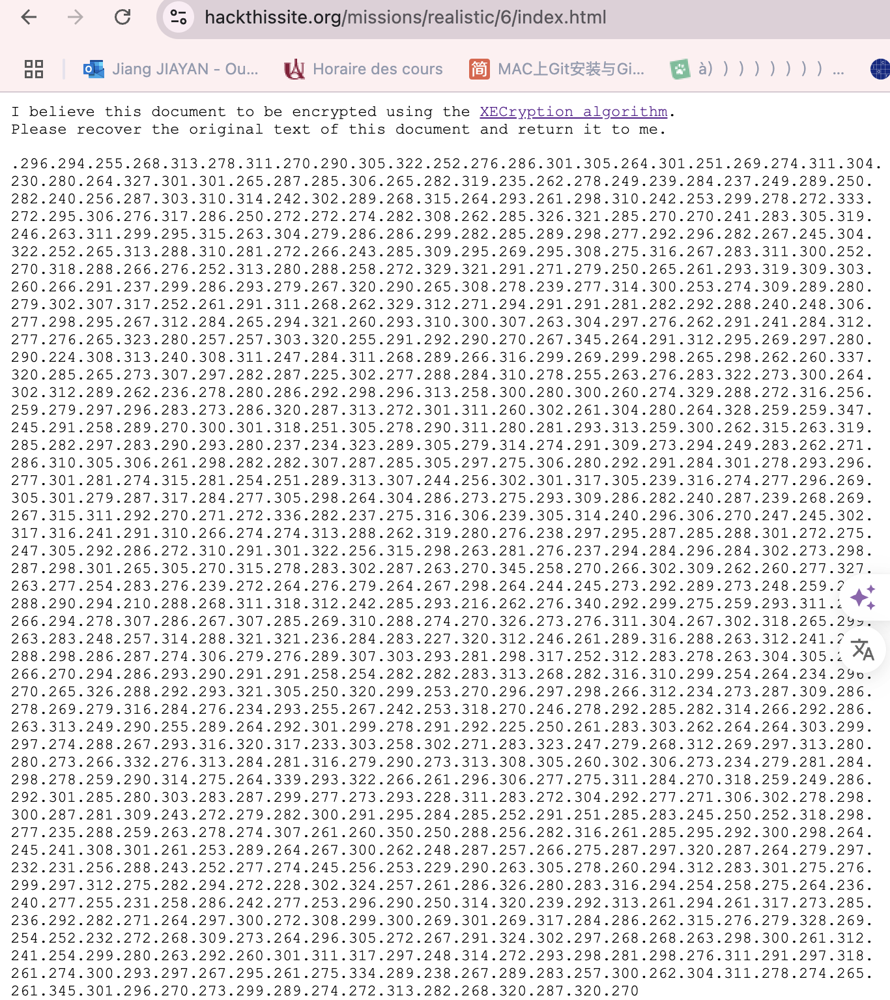
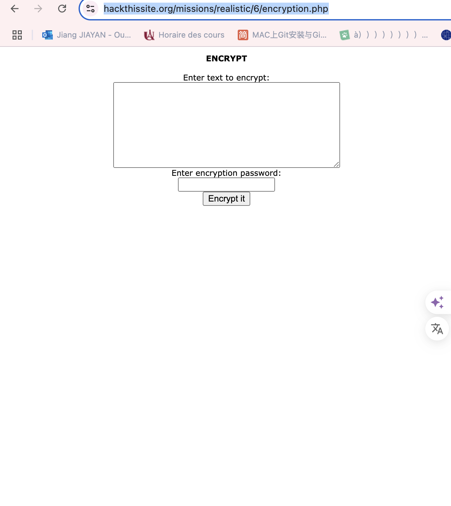
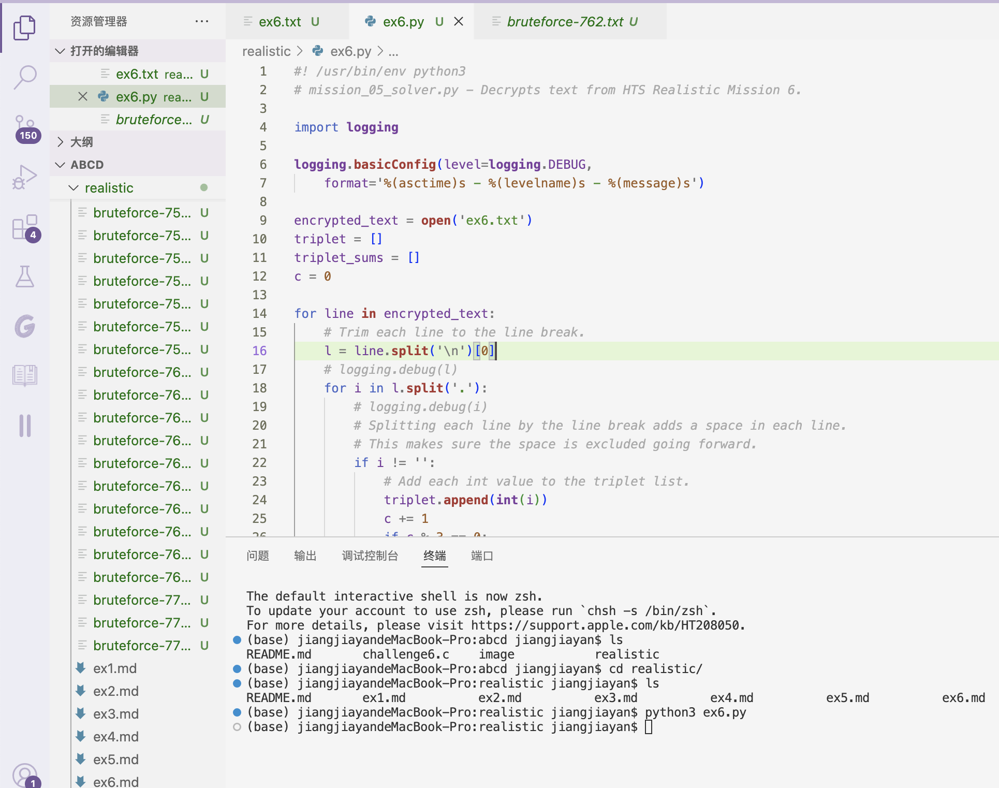
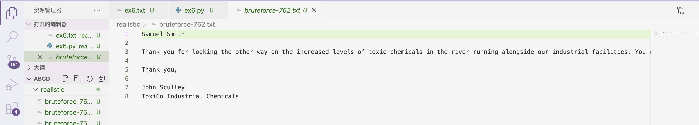

##  6. ToxiCo Industrial Chemicals
### Méthod: cryptography 

1.https://www.hackthissite.org/missions/realistic/6/index.html

2. La message cryptée affiche sur l’écran, et l'algo de cryptologie est dans la lien de `XECryption algorithm`
https://www.hackthissite.org/missions/realistic/6/encryption.php

3.L'algo de cryptologie 

Essayez de saisir une entrée de base telle que « a » (moins les guillemets). N'entrez pas de mot de passe et chiffrez-le. Le texte crypté est une série de trois chiffres séparés par des points, comme .10.33.-11. Essayez à nouveau de chiffrer « a » et la séquence change. Mais chaque fois que vous chiffrez un a minuscule sans ajouter de mot de passe, vérifiez la somme des trois nombres et elle est toujours égale à 97, la valeur décimale du a minuscule en ASCII. Les trois nombres sont générés aléatoirement, mais toujours égaux à 97.

Essayez d'ajouter un mot de passe – j'ai utilisé un a minuscule comme mot de passe et j'ai à nouveau chiffré un a minuscule. Les nombres ont changé, mais cette fois, leur somme est égale à 194, ou 97 * 2. Essayez de changer le mot de passe en quelque chose comme « ab » et voyez ce qui se passe lorsque vous chiffrez un a minuscule : sa somme est de 292, ou 97 (la minuscule a comme entrée) + 198 (la somme de 97 + 98, les valeurs décimales ASCII du mot de passe). Alors maintenant, nous connaissons le modèle. Le texte du mot de passe est converti en valeurs décimales ASCII et additionné. Ensuite, pour chaque caractère du texte saisi, il est converti en une valeur décimale ASCII, ajoutée à la somme de la valeur du mot de passe, puis divisé de manière aléatoire en trois valeurs. La clé pour annuler tout message chiffré à l’aide de cet algorithme semble donc être de trouver d’abord le mot de passe.

4. Programme l'algo décrypte par python

Après l'exécution du script, plusieurs fichiers seront générés (bruteforce-<numéro>.txt), chacun contenant une tentative de déchiffrement avec une combinaison de mots de passe différente. En les vérifiant un par un, le fichier brute-force 762 contient le texte correctement déchiffré.

